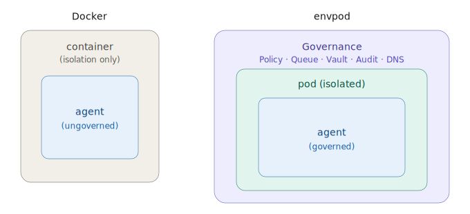

# envpod vs Docker

> **EnvPod v0.1.1** — Zero-trust governance environments for AI agents
> Author: Mark Amoboateng · mark@envpod.dev
> Copyright 2026 Xtellix Inc. · Licensed under BSL-1.1

---

Docker is the world's most widely used container runtime. If you know Docker, you can understand envpod immediately — it uses the same Linux primitives. But envpod was built for a fundamentally different purpose: **governing what an AI agent does, not just isolating where it runs.**

> "Docker isolates. Envpod governs."

This document covers every significant Docker feature, shows what envpod does in the same space, and explains what envpod adds beyond isolation.

---

## Table of Contents

- [The Core Difference](#the-core-difference)
- [Command Mapping](#command-mapping)
- [Feature Comparison](#feature-comparison)
  - [Isolation Primitives](#isolation-primitives)
  - [Filesystem](#filesystem)
  - [Networking](#networking)
  - [Resource Limits](#resource-limits)
  - [Security Hardening](#security-hardening)
  - [Configuration](#configuration)
  - [Image / Pod Management](#image--pod-management)
  - [Secrets & Credentials](#secrets--credentials)
  - [Monitoring & Logging](#monitoring--logging)
  - [Developer Experience](#developer-experience)
  - [Multi-Container / Fleet](#multi-container--fleet)
  - [Platform Support](#platform-support)
- [What envpod Adds: The Governance Ceiling](#what-envpod-adds-the-governance-ceiling)
- [What Docker Has That envpod Doesn't (Yet)](#what-docker-has-that-envpod-doesnt-yet)
- [When to Use Each](#when-to-use-each)
- [Migration Cheatsheet](#migration-cheatsheet)

---

## The Core Difference

Docker answers: **"Where does this process run?"** It draws a box around the process and controls what it can see (filesystem, network, PIDs).

envpod answers: **"What is this process allowed to do?"** It draws the same box, then adds a governance ceiling: every significant action is intercepted, queued, validated, audited, and optionally requires human approval before execution.



---

## Command Mapping

| Docker | envpod | Notes |
|---|---|---|
| `docker build` | `envpod init --setup` | Setup commands run inside the pod instead of a Dockerfile |
| `docker run` | `envpod run` | Starts the pod and runs a command |
| `docker ps` | `envpod ls` | List running/created pods |
| `docker diff` | `envpod diff` | Show filesystem changes vs baseline |
| `docker commit` | `envpod commit` | Persist changes — but with human review first |
| `docker logs` | `envpod audit` | Structured audit log, not raw stdout |
| `docker stop` | `envpod lock` | Freeze pod (pause all processes) |
| `docker kill` | `envpod destroy` | Destroy pod and clean up |
| `docker exec` | `envpod run` | Re-run a command in the same pod namespace |
| `docker cp` | Read from `{pod_dir}/upper/` | Changes live in overlay upper directory |
| `docker inspect` | `envpod ls --json`, `pod.yaml` | Pod config + runtime state |
| `docker secret` | `envpod vault set` | Encrypted vault (much richer) |
| `docker-compose up` | `envpod run` (multiple pods) | Pod-to-pod discovery via DNS |
| `docker save/load` | `envpod base export/import` | Base pod snapshots (Premium) |
| `docker tag/push/pull` | Base pod registry (Enterprise) | Shared team pod templates |

---

## Feature Comparison

### Isolation Primitives

Both envpod and Docker use Linux kernel primitives — they're the same box, built differently.

| Feature | Docker | envpod | Notes |
|---|---|---|---|
| PID namespace | ✓ | ✓ | Process isolation |
| Mount namespace | ✓ | ✓ | Filesystem isolation |
| Network namespace | ✓ | ✓ | Network isolation |
| UTS namespace | ✓ | ✓ | Hostname isolation |
| User namespace | ✓ | ✓ | UID/GID remapping |
| IPC namespace | ✓ | — | Not yet implemented |
| OverlayFS / Union FS | ✓ | ✓ | Copy-on-write filesystem |
| Static binary (no daemon) | — | ✓ | envpod has no central daemon; Docker requires dockerd |
| Rootless mode | ✓ | Planned | Docker supports rootless; envpod currently requires root for namespace setup |

---

### Filesystem

This is where envpod and Docker diverge significantly.

| Feature | Docker | envpod | Notes |
|---|---|---|---|
| Union filesystem (layers) | ✓ | ✓ | Both use OverlayFS |
| Read-only bind mounts | ✓ | ✓ | System dirs read-only by default |
| Writable volumes | ✓ | ✓ via overlay | envpod writes go to overlay upper, not host directly |
| `docker diff` (changed files) | ✓ | ✓ | Same concept |
| `docker commit` (persist) | ✓ | ✓ | But Docker auto-commits; envpod requires human review |
| **Human review before commit** | — | ✓ | Host sees every change before it reaches the host FS |
| **Selective commit (per-path)** | — | ✓ | `envpod commit --paths src/` |
| **Selective commit + auto-rollback** | — | ✓ | `envpod commit src/ --rollback-rest` — commit what you want, discard the rest in one step |
| **Rollback** | — | ✓ | `envpod rollback` undoes all agent changes |
| **Named snapshots** | — | ✓ | Save/restore filesystem state mid-run |
| **Auto-snapshot before run** | — | ✓ | Always safe to rollback to pre-run state |
| System directory COW | — | ✓ | `system_access: advanced` gives agent per-dir COW overlays for `/usr`, `/bin`, etc. |

**Key difference:** In Docker, when a container writes a file and you commit it, the change is permanent. In envpod, the agent's writes are staged in the overlay — the host reviews them with `envpod diff` and explicitly approves with `envpod commit` (or rejects with `envpod rollback`).

---

### Networking

| Feature | Docker | envpod | Notes |
|---|---|---|---|
| Network namespace | ✓ | ✓ | Complete network isolation |
| Bridge network | ✓ | veth pairs | Different implementation, same effect |
| Host networking mode | ✓ | ✓ via `network: {mode: Unsafe}` | |
| Port forwarding (localhost) | `-p` / `--publish` | `ports: ["8080:3000"]` | |
| Port forwarding (all interfaces) | `-P` / `--publish-all` | `public_ports: ["8080:3000"]` | envpod flags this as a security finding |
| **Pod-to-pod networking** | Docker networks | `internal_ports` + `allow_pods` | envpod uses DNS-based discovery, not bridge networks |
| DNS resolution | Container DNS | ✓ per-pod resolver | envpod embeds a full DNS server per pod |
| **DNS allow/deny lists** | — | ✓ | `network.allow: [api.openai.com]` |
| **DNS remap / CNAME override** | — | ✓ | Remap domains to different IPs |
| **Anti-DNS-tunneling** | — | ✓ | Rejects excessively long labels, random-looking subdomains |
| **Bandwidth rate limits** | ✓ (via tc) | ✓ | `network.bandwidth_limit_mbps` |
| **Live DNS mutation** | — | ✓ | Add/remove allow rules while pod is running, no restart |
| **Pod-to-pod discovery** | Docker Compose service names | `*.pods.local` DNS | Bilateral policy enforcement via central dns-daemon |
| Custom DNS servers | `--dns` flag | `network.dns_servers` | |
| Disable networking | `--network none` | `network.mode: Isolated` | |

---

### Resource Limits

| Feature | Docker | envpod | Notes |
|---|---|---|---|
| CPU limits | `--cpus`, `--cpu-shares` | `processor.cpu_cores` | Both use cgroups v2 |
| Memory limits | `--memory` | `processor.memory_limit_mb` | |
| Memory swap limits | `--memory-swap` | Planned | |
| IO limits | `--blkio-weight` | `processor.io_weight` | |
| PID limit | `--pids-limit` | `processor.max_pids` | |
| CPU affinity | — | `processor.cpu_affinity` | Pin to specific CPU cores |
| GPU access | `--gpus` | `devices.gpu: true` | envpod auto-mounts all GPU devices |
| **Cache partitioning (Intel CAT)** | — | Planned | Side-channel defense |

---

### Security Hardening

| Feature | Docker | envpod | Notes |
|---|---|---|---|
| seccomp-BPF profiles | ✓ default profile | ✓ | envpod applies seccomp on run |
| AppArmor / SELinux | ✓ | Planned | |
| Drop capabilities (`--cap-drop`) | ✓ | Planned | |
| Read-only root filesystem | `--read-only` | ✓ COW overlay | envpod overlay is inherently COW |
| Non-root user | `USER` in Dockerfile | `agent` user (UID 60000) | envpod default is non-root |
| No-new-privileges | `--security-opt no-new-privileges` | ✓ default | |
| **Static security audit** | Docker Scout (separate tool) | `envpod audit --security` | Built-in, runs on pod.yaml without starting the pod |
| **Security findings with guidance** | — | ✓ | N-03 through V-03 findings with remediation steps |

---

### Configuration

| Feature | Docker | envpod | Notes |
|---|---|---|---|
| Configuration format | Dockerfile + `docker run` flags | `pod.yaml` | Single declarative file for everything |
| Environment variables | `-e KEY=VALUE` | `env:` block in pod.yaml | |
| Secrets (env vars) | `--env-file`, Docker secrets | `envpod vault set` | Vault is encrypted at rest; Docker env secrets are plaintext in process env |
| Volume mounts | `-v host:container` | `filesystem.bind_mounts` | |
| Entrypoint | `ENTRYPOINT` in Dockerfile | `entrypoint:` in pod.yaml | |
| Working directory | `WORKDIR` | `filesystem.workspace` | |
| **Hot-reload config** | No (container restart required) | ✓ (DNS, action catalog, discovery) | Change policy while pod is running |

---

### Image / Pod Management

| Feature | Docker | envpod | Notes |
|---|---|---|---|
| Base image (starting rootfs) | Docker Hub images | `envpod init` (host rootfs) | envpod currently uses the host filesystem as the lower layer |
| Custom rootfs | `FROM` in Dockerfile | Planned (Premium) | Alpine, debootstrap, OCI images |
| Layered builds | Multi-stage Dockerfile | Setup commands in pod.yaml | Same idea: run commands, snapshot the result |
| **Base pods** | Docker base images | `envpod base create` | Snapshot after setup for fast reuse |
| **Fast clone** | `docker pull` (registry) | `envpod clone` (~130ms) | Clones from base snapshot, symlinks rootfs |
| Clone from current state | `docker commit` + `docker run` | `envpod clone --current` | |
| Image export/import | `docker save/load` | `envpod base export/import` (Premium) | |
| Garbage collection | `docker system prune` | `envpod gc` | |
| **Named snapshots** | Docker doesn't have runtime snapshots | `envpod snapshot create` | Save/restore mid-execution state |

---

### Secrets & Credentials

This is where envpod has a substantial advantage over Docker.

| Feature | Docker | envpod | Notes |
|---|---|---|---|
| Environment variable secrets | ✓ (plaintext in process env) | ✓ | Available in Docker and envpod |
| Docker Swarm secrets (file in container) | ✓ | — | Docker-specific |
| **Encrypted vault** | — | ✓ | ChaCha20-Poly1305 encrypted at rest |
| **Vault proxy injection (Premium)** | — | ✓ | Agent never sees real API keys |
| → Transparent TLS MITM | — | ✓ | Per-pod ephemeral CA via rcgen |
| → Header injection without agent access | — | ✓ | Real key fetched at execution time |
| → Agent uses dummy key | — | ✓ | Even if agent is compromised, no real key to exfiltrate |
| **Vault live mutation** | — | ✓ | Add/change secrets while pod is running |

In Docker, secrets injected as environment variables can be read by any process in the container: `cat /proc/1/environ`. In envpod, vault proxy injection means the agent submits a request with a dummy key — the proxy swaps in the real key and the agent cannot read it from env, memory, or any other path.

---

### Monitoring & Logging

| Feature | Docker | envpod | Notes |
|---|---|---|---|
| stdout/stderr logs | `docker logs` | Stdout is visible as usual | |
| Structured audit log | — | ✓ | `audit.jsonl` with every action, timestamp, and outcome |
| Live resource stats | `docker stats` | `envpod audit --resources` / dashboard | |
| **Action-level audit** | — | ✓ | Every queue call, approval, and execution recorded |
| **Security audit (static)** | Docker Scout (separate, paid) | `envpod audit --security` | Free, built-in, runs on pod.yaml |
| **Monitoring agent** | — | ✓ | AI agent watches for anomalies in pod behavior |
| Health checks | `HEALTHCHECK` in Dockerfile | Monitoring agent | |
| **Web dashboard** | Portainer (3rd party) | `envpod dashboard` | Built-in, shows fleet + diff + audit + resources |

---

### Developer Experience

| Feature | Docker | envpod | Notes |
|---|---|---|---|
| Interactive shell | `docker exec -it` | `envpod run ... -- bash` | |
| Attach to running container | `docker attach` | `envpod fg <name>` | Ctrl+Z to detach, `-b` for background |
| Port forwarding (dev) | `-p` | `ports:` in pod.yaml | |
| Watch mode (file sync) | Docker Compose watch | Planned | |
| IDE integration | Docker extension for VS Code | Planned | |
| **Web dashboard** | Portainer (3rd party, complex) | `envpod dashboard` (built-in, lightweight) | |
| CLI binary | Docker CLI + Docker daemon | Single static binary | envpod ships as one ~12MB static musl binary |
| No daemon required | No (dockerd required) | ✓ | envpod is a CLI tool, no persistent background service |
| **Human approval workflow** | — | ✓ | `envpod approve`, `envpod cancel` |

---

### Multi-Container / Fleet

| Feature | Docker | envpod | Notes |
|---|---|---|---|
| Multiple containers | ✓ | ✓ (multiple pods) | |
| Service discovery | Docker Compose service names | `*.pods.local` DNS | envpod uses bilateral policy enforcement |
| Shared volumes | Docker volumes | Planned | |
| Docker Compose (declarative multi-service) | ✓ | `envpod run` (per pod) | envpod doesn't have a Compose equivalent yet |
| Swarm / orchestration | Docker Swarm | Enterprise fleet (roadmap) | |
| Kubernetes compatible | ✓ (via CRI) | — | envpod is not a CRI runtime |

---

### Platform Support

| Feature | Docker | envpod | Notes |
|---|---|---|---|
| Linux | ✓ | ✓ | Both native |
| macOS | ✓ (via VM) | — | envpod is Linux-only (uses Linux namespaces directly) |
| Windows | ✓ (WSL2 / Hyper-V) | — | Linux-only |
| ARM64 (Raspberry Pi, Jetson) | ✓ | ✓ | envpod ships static ARM64 binary |
| x86_64 | ✓ | ✓ | |
| Multi-arch images | ✓ (buildx) | N/A | envpod uses host rootfs, not images |

---

## What envpod Adds: The Governance Ceiling

These features have no Docker equivalent. They exist specifically to govern AI agent behavior.

### 1. Copy-on-Write Filesystem with Human Review

Docker lets containers write files and `docker commit` makes them permanent immediately. In envpod:

- Agent writes go to the overlay — the host filesystem is unchanged
- `envpod diff` shows exactly what the agent wrote
- `envpod commit` applies changes after human review
- `envpod rollback` discards all agent changes

The agent runs in a COW sandbox. Nothing it does is permanent until a human approves it.

### 2. Action Queue with Approval Tiers

The agent declares its intent — `send_email`, `git_push`, `http_post` — and envpod queues the action. The human sees it, can inspect the params, and either approves or cancels.

```
Tiers:
  immediate  → executes now (COW-protected for filesystem ops)
  delayed    → executes after 30s grace period unless cancelled
  staged     → waits for: envpod approve <id>
  blocked    → permanently rejected, cannot be approved
```

Docker has no equivalent. A container can make HTTP requests, send emails, or push to git without any checkpoint.

### 3. Action Catalog (MCP-style Tool Discovery)

The host defines a menu of allowed actions in `actions.json`. The agent queries this menu at runtime and can only call defined actions. envpod validates every call against the schema, executes it, and audits the result.

This is the [MCP tool use pattern](https://modelcontextprotocol.io/), but governed: every tool call flows through the queue and requires the appropriate approval tier.

### 4. Encrypted Credential Vault with Proxy Injection

Docker injects secrets as environment variables — readable by any process, shell, or debug tool in the container. envpod provides:

- **Vault (OSS):** encrypted ChaCha20-Poly1305 storage, injected as env vars at run time
- **Vault proxy injection (Premium):** transparent HTTPS MITM proxy. The agent submits requests with a dummy key. The proxy replaces the dummy with the real secret from the vault and forwards the request. The agent cannot read the real key from anywhere.

### 5. Per-Pod DNS Resolver with Policy

Every pod gets its own embedded DNS server. The host controls what the agent can resolve:

```yaml
network:
  mode: Filtered
  allow:
    - api.openai.com
    - api.github.com
  deny:
    - "*.s3.amazonaws.com"   # block S3 exfiltration
```

Changes take effect while the pod is running — no restart needed. Docker has no per-container DNS policy engine.

### 6. Structured Audit Log

Every significant event is recorded in `{pod_dir}/audit.jsonl`:

```json
{"ts":"2026-03-03T14:22:01Z","action":"file_write","status":"executed","path":"/workspace/output.json"}
{"ts":"2026-03-03T14:22:05Z","action":"send_email","status":"queued","tier":"staged","to":"team@co.com"}
{"ts":"2026-03-03T14:25:11Z","action":"send_email","status":"executed","approved_by":"host"}
```

Docker logs stdout/stderr. envpod logs what the agent *did*.

### 7. Static Security Audit

```bash
sudo envpod audit --security -c pod.yaml
```

Runs without starting the pod. Checks for common misconfigurations:

- N-03: DNS bypass (Unsafe network mode — agent can reach any domain)
- N-04: Public ports exposed to all interfaces
- V-01: Vault bindings defined but proxy disabled
- V-02: Vault proxy active with Unsafe network (secrets could leak)
- I-04: X11 display forwarding (host X11 socket is accessible)

### 8. Remote Control and Live Mutation

While a pod is running:

```bash
sudo envpod lock myagent          # freeze all processes immediately
sudo envpod vault live set myagent KEY value   # add a secret
sudo envpod discover myagent --add-pod service # enable pod-to-pod discovery
```

No restart required.

#### Live and Stopped Mutation Comparison

| Mutation | envpod | Docker |
|----------|--------|--------|
| CPU/memory resize (live) | `envpod resize --cpus 4 --memory 8GB` | `docker update --cpus 4 --memory 8g` |
| /tmp resize (live) | `envpod resize --tmp-size 4GB` | Not possible |
| DNS policy (live) | `envpod dns --allow/--deny` | Not possible (must recreate) |
| Port forwarding (live) | `envpod ports --publish 8080:3000` | Not possible (must recreate) |
| Mount paths (live) | `envpod mount ~/data` | Not possible (must recreate) |
| Freeze/resume (live) | `envpod lock/unlock` | `docker pause/unpause` |
| Secrets (live) | `envpod vault set` | Not possible (must recreate) |
| Pod discovery (live) | `envpod discover --on` | Not possible |
| GPU toggle (stopped) | `envpod resize --gpu true` | Not possible (must recreate) |
| Display/audio (stopped) | `envpod resize --display true` | Not possible (must recreate) |
| Desktop env (stopped) | `envpod resize --desktop xfce` | Not possible (must recreate) |
| Web display (stopped) | `envpod resize --web-display novnc` | Not possible (must recreate) |

Docker's fundamental limitation: most config changes require `docker rm` + `docker run`, which **destroys the container filesystem** unless you first `docker commit` to an image. envpod's overlay persists independently — stop, resize, start again with no data loss.

---

## What Docker Has That envpod Doesn't (Yet)

envpod is purpose-built for AI agent governance on a single Linux machine. It is not trying to replace Docker for all use cases. Here is what Docker has today that envpod does not:

| Feature | Status in envpod |
|---|---|
| Pre-built image library (Docker Hub) | Not applicable — envpod uses host rootfs |
| Multi-stage builds (Dockerfile) | Setup commands in pod.yaml are the equivalent; multi-stage not needed |
| macOS and Windows support | Planned (VM backend) |
| Kubernetes CRI compatibility | Not planned — envpod is not a container runtime |
| Docker Compose (multi-service declarative) | Planned for fleet config |
| Docker Swarm orchestration | Enterprise fleet roadmap |
| BuildKit / advanced build cache | Not applicable |
| Docker Desktop (GUI app for developers) | envpod dashboard is the equivalent (web UI) |
| Rootless mode | Planned |
| Windows containers | Not planned |
| Production battle-hardening at massive scale | Docker has years of production use; envpod is new |

---

## When to Use Each

### Use Docker when:

- You are running **any workload** that does not involve an AI agent making autonomous decisions
- You need macOS or Windows support
- You need to pull from Docker Hub and use existing images
- You are deploying microservices, APIs, or databases
- You need Kubernetes integration
- You need multi-platform builds

### Use envpod when:

- You are running **AI agents** that make decisions and take actions
- You need to review filesystem changes before they reach the host
- You need human approval before the agent sends emails, makes API calls, or pushes to git
- You need to be able to say: "the agent *cannot* exfiltrate your API keys" (vault proxy)
- You need an audit trail of what the agent did, not just what it printed
- You need DNS-level network policy (block all domains except a whitelist)
- You need to run agents on ARM64 embedded hardware (Raspberry Pi, Jetson)

### Use both:

envpod's Docker backend (Premium roadmap) will let you run pods inside Docker containers — combining Docker's ecosystem with envpod's governance layer. Deploy the Docker image however you like; envpod governs what the agent inside it can do.

---

## Real-World Example: Full Desktop Workstation

A full workstation with Chrome, Firefox, VS Code, GIMP, and LibreOffice in a desktop environment, accessible via browser (noVNC):

| | envpod | Docker |
|---|---|---|
| **Config** | 83-line YAML + 9KB setup script | Dockerfile + docker-compose.yaml + supervisord.conf + VNC config (200+ lines across 4-5 files) |
| **Config size** | 11.4 KB total | ~15-25 KB across multiple files |
| **Disk usage** | 2.6 GB (overlay delta only) | 5-7 GB (full image with OS base) |
| **Setup time** | `envpod init` — 5 min (incremental, resumable) | `docker build` — 10-15 min (restarts from failed layer) |
| **Clone** | `envpod clone` — instant (symlinked rootfs) | `docker run` — new container from image (no state) |
| **Add an app** | `envpod run ... -- bash desktop-app-setup.sh slack` | Rebuild entire image |
| **Review changes** | `envpod diff` → `envpod commit` or `rollback` | Not possible — changes are permanent |
| **Live resize** | `envpod resize --memory 16GB --cpus 8` | `docker update --memory 16g --cpus 8` (CPU/memory only) |
| **Add GPU** | `envpod resize --gpu` (stopped) | `docker rm` + `docker run --gpus all` (recreate) |
| **Audit trail** | `envpod audit` — every action logged | Manual logging setup required |
| **DNS filtering** | Built-in per-pod DNS with blacklist/whitelist | Requires external DNS proxy |

---

## Migration Cheatsheet

### Dockerfile → pod.yaml

```dockerfile
# Dockerfile
FROM ubuntu:24.04
RUN apt-get update && apt-get install -y python3 pip
RUN pip install anthropic requests
WORKDIR /workspace
ENV PYTHONPATH=/workspace
COPY agent.py /workspace/
CMD ["python3", "agent.py"]
```

```yaml
# pod.yaml
name: my-agent
filesystem:
  workspace: /workspace
network:
  mode: Filtered
  allow:
    - api.anthropic.com
    - pypi.org
setup:
  - apt-get update -qq
  - apt-get install -y python3 python3-pip
  - pip3 install anthropic requests
```

```bash
sudo envpod init my-agent -c pod.yaml
sudo envpod run my-agent -- python3 agent.py
```

### docker-compose.yml → multiple pods

```yaml
# docker-compose.yml
services:
  api:
    image: python:3.12
    ports: ["8080:8080"]
  worker:
    image: python:3.12
    environment:
      - API_URL=http://api:8080
```

```yaml
# api/pod.yaml
name: api
ports: ["8080:8080"]
network:
  allow_discovery: true

# worker/pod.yaml
name: worker
network:
  allow_pods: ["api"]
  allow:
    - api.pods.local
```

```bash
sudo envpod dns-daemon &       # start discovery daemon
sudo envpod run api -- python3 api.py
sudo envpod run worker -- python3 worker.py
```

### docker run flags → pod.yaml

| `docker run` flag | pod.yaml equivalent |
|---|---|
| `-e KEY=VALUE` | `env: {KEY: VALUE}` |
| `-p 8080:3000` | `ports: ["8080:3000"]` |
| `-P 8080:3000` | `public_ports: ["8080:3000"]` |
| `--memory 512m` | `processor: {memory_limit_mb: 512}` |
| `--cpus 2` | `processor: {cpu_cores: 2}` |
| `--read-only` | COW overlay is inherently copy-on-write |
| `--network none` | `network: {mode: Isolated}` |
| `--security-opt seccomp=profile.json` | `security: {seccomp_profile: "..."} ` |
| `--user 1000:1000` | `security: {user: "agent"}` |
| `--gpus all` | `devices: {gpu: true}` |
| `--device /dev/snd` | `devices: {audio: true}` |
| `-v /host/path:/container/path` | `filesystem: {bind_mounts: [{host: "/host/path", container: "/container/path"}]}` |
| `-d` (detach) | `envpod run -b` or Ctrl+Z during run |
| `docker attach` | `envpod fg <name>` |

---

*Copyright 2026 Xtellix Inc. All rights reserved.*
