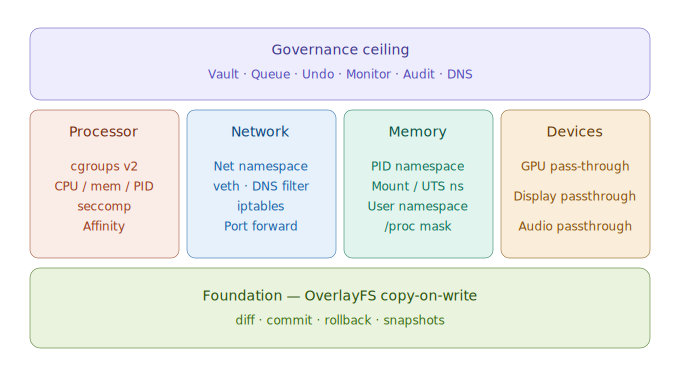

# Frequently Asked Questions

> **EnvPod v0.1.1** — Zero-trust governance environments for AI agents
> Author: Mark Amoboateng · mark@envpod.dev
> Copyright 2026 Xtellix Inc. · Licensed under BSL-1.1

---

## What is the difference between envpod and Docker?

Docker is a **container runtime** — it builds isolated environments from scratch using container images. You define a `Dockerfile`, build an image with all dependencies, and run containers from that image. Docker's focus is packaging and deploying applications.

Envpod is a **governance layer** — it takes your existing host system and wraps it with isolation walls and a governance ceiling. Instead of building from scratch, envpod overlays your real filesystem with copy-on-write (OverlayFS), so the agent sees the host's tools and libraries but can't modify anything directly. Every change is captured, reviewable, and reversible.

| | Docker | Envpod |
|---|---|---|
| **Approach** | Build from scratch (images) | Overlay existing system |
| **Filesystem** | Layered image, no diff/commit review | COW overlay with `diff → commit/rollback` |
| **Governance** | None — run and hope | Policy engine, audit, vault, action queue, monitoring, remote lockdown |
| **Reversibility** | None — changes are permanent | Built-in: selective commit, rollback, undo registry |
| **Target use case** | Application deployment | AI agent governance |

Docker answers: "How do I package and run this app?" Envpod answers: "How do I let an AI agent run safely on my system?"

---

## Can I run a different Linux OS inside an envpod?

No. Envpod pods always run the same OS as the host.

Envpod bind-mounts `/usr`, `/bin`, `/lib`, and other system directories directly from the host into the pod's rootfs. The pod uses the host's kernel, binaries, and libraries — if the host runs Ubuntu 24.04, the pod runs Ubuntu 24.04. There's no image layer or separate userspace.

Docker works differently. A Docker container ships a complete userspace inside its image — you can run an Ubuntu container on a Fedora host because the image includes Ubuntu's libraries and package manager. (They still share the host kernel though — you can't run Windows in a Linux Docker container.)

This is a deliberate tradeoff:

| | Docker | Envpod |
|---|---|---|
| **OS flexibility** | Any Linux distro via images | Same as host only |
| **Setup time** | Build/pull image (seconds to minutes) | Instant — no image needed |
| **Host tools** | Must install in image | All host tools available immediately |
| **Image management** | Dockerfiles, registries, layers | None — overlays the existing system |

Envpod optimizes for the AI agent use case: the agent needs the tools already installed on your system, not a different distro.

However, envpod's `IsolationBackend` trait is pluggable. Future backends will unlock different OS support:

| Backend | Status | OS Flexibility |
|---------|--------|----------------|
| **Native** (current) | v0.1 | Same as host only |
| **Docker** (planned) | v0.2 | Any Linux distro via Docker images, with envpod's governance on top |
| **VM** (planned) | v0.3 | Full OS flexibility via Firecracker/QEMU microVMs |

The governance layer (audit, vault, queue, diff/commit) works identically regardless of backend — that's the point of the trait separation.

**What about nesting — Docker inside envpod, or envpod inside Docker?**

| Scenario | Possible? | Recommended? |
|----------|-----------|--------------|
| **Docker inside envpod** | Technically yes, but requires relaxing seccomp filters and granting device access | No — undermines the security model |
| **Envpod inside Docker** | Requires `--privileged` Docker container for namespace/cgroup access | No — nesting isolation layers is fragile |
| **Envpod's Docker backend** | Designed approach — envpod governs, Docker isolates | Yes — this is the planned v0.2 integration |

The right way to combine them is envpod's Docker backend: Docker provides the container (and OS flexibility), envpod provides the governance ceiling (audit, vault, diff/commit, action queue, monitoring). You don't nest one inside the other — envpod sits on top and drives Docker as its isolation engine.

---

## At what levels of isolation does envpod offer?

Think of a pod as a building: a COW filesystem foundation underneath, four walls for isolation, and a governance ceiling on top:



Envpod provides a **foundation**, **four isolation walls**, and a **governance ceiling**:

**Foundation:**

| Layer | Mechanism | What It Protects |
|-------|-----------|-----------------|
| **COW Filesystem** | OverlayFS (copy-on-write) + snapshots | Host files are never modified directly. All writes go to an overlay layer that you review before committing. The foundation makes everything else reversible. |

**Four Walls:**

| Wall | Mechanism | What It Protects |
|------|-----------|-----------------|
| **Processor** | cgroups v2 + CPU affinity + seccomp-BPF | CPU/memory/PID limits, syscall filtering. The agent can't exhaust host resources or call dangerous syscalls. |
| **Network** | Network namespace + veth pairs + embedded DNS resolver | Per-pod IP address, domain-level allow/deny, rate limiting. The agent can only reach domains you whitelist. |
| **Memory** | PID namespace + /proc masking + coredump prevention | The agent can't see host processes, can't read other pods' memory, and can't dump core. |
| **Devices** | Selective GPU, display, audio passthrough + minimal `/dev` | The agent only sees essential pseudo-devices. GPU and hardware devices are hidden unless explicitly allowed. |

On top sits the **governance ceiling**: audit logging, credential vault, action staging queue, monitoring agent, and remote lockdown. No other sandbox provides this layer.

---

## So Docker builds isolation from starting afresh? Envpod takes the existing system and narrows down with an overlay?

Exactly. They work in opposite directions:

**Docker: bottom-up.** You start with nothing (an empty image layer) and add what you need — base OS, libraries, tools, your code. The container only has what you explicitly put in.

**Envpod: top-down.** You start with your existing host system and subtract what the agent shouldn't access. Envpod creates a minimal rootfs skeleton with only system essentials (`/usr`, `/etc`, `/bin`) bind-mounted read-only from the host. Directories like `/home`, `/var`, and `/opt` start empty — the agent can't see your personal files. All agent writes land in a copy-on-write overlay that you review before applying.

This top-down approach means:
- No image builds, no Dockerfiles, no registry
- The agent immediately has access to all tools already installed on your host
- You control what the agent can change, not what it can see
- Every filesystem change is captured and reversible

---

## Why does `envpod diff` look like git operations? Does Docker have something similar?

The resemblance to git is intentional. Envpod's filesystem workflow mirrors the git review loop:

```
git:    edit → git diff → git add → git commit
envpod: run  → envpod diff → envpod commit (selective or all)
```

Just like git lets you review changes before committing, envpod lets you review what an AI agent changed before applying it to your real filesystem. You can even do selective commits — pick specific files to keep and leave the rest in the overlay:

```bash
envpod diff my-agent                        # see all changes
envpod commit my-agent /opt/a /opt/b        # commit only these files
envpod commit my-agent --exclude /opt/c     # commit all except this
envpod rollback my-agent                    # discard everything
```

**Docker does not have this.** Docker has `docker diff` which shows filesystem changes in a container, but there is no `docker commit` that selectively applies changes back to the host. Docker's `docker commit` creates a new image layer — it doesn't modify your host filesystem. There is no review-and-approve workflow for host changes.

This diff/commit/rollback cycle is fundamental to envpod's zero-trust model: the agent can do whatever it wants inside the pod, but nothing touches the real filesystem until a human explicitly approves it.

---

## What can envpod run?

Anything that runs on Linux. Envpod uses native Linux isolation (namespaces, cgroups, OverlayFS) — there's no VM or emulation layer. The agent process runs directly on the host kernel with the same architecture.

Common workloads:

| Workload | Example |
|----------|---------|
| **AI coding agents** | Claude Code, Codex CLI, Aider, SWE-agent |
| **Browser automation** | Playwright, Puppeteer, browser-use (with `seccomp_profile: browser`) |
| **ML training** | PyTorch, TensorFlow (with `gpu: true` for GPU passthrough) |
| **Shell scripts** | Any bash/sh/python/node script |
| **Interactive shells** | `envpod run my-pod -- /bin/bash` |
| **Servers** | Web servers, APIs, databases (within the pod's network namespace) |

The only requirement is that the binary exists on the host system (since the pod's rootfs bind-mounts `/usr`, `/bin`, etc. from the host). If `python3` is installed on your host, it's available inside the pod.

---

## When I create an envpod, what happens? Is the pod alive or dead until I run something?

After `envpod init`, the pod is in a **Created** state — think of it as a prepared room with the lights off. The infrastructure is set up but nothing is running:

- Overlay directories created (upper, work, merged, rootfs)
- cgroup allocated for resource limits
- Network namespace created with veth pair and DNS resolver (if network isolation is configured)
- Pod state saved to disk
- Setup commands executed (if defined in pod.yaml)

**No process is running.** The pod is dormant until you explicitly start something with `envpod run`. Each `envpod run` spawns a new isolated process inside the pod — when that process exits, the pod returns to its dormant state. The overlay filesystem persists between runs, so files created in one `envpod run` session are visible in the next.

```bash
envpod init my-agent -c pod.yaml     # Created — dormant, no processes
envpod run my-agent -- /bin/bash     # Running — process active
# exit the shell                     # Back to dormant
envpod run my-agent -- python3 x.py  # Running again — overlay state preserved
# script exits                       # Dormant again
envpod destroy my-agent              # Gone — all state removed
```

---

## Do I have to use the same file names during mounting?

No. You can mount a host path to a different location inside the pod using the `--target` flag:

```bash
# Mount at the same path (default)
sudo envpod mount my-agent /home/user/data
# Host /home/user/data → Pod /home/user/data

# Mount at a different path
sudo envpod mount my-agent /home/user/data --target /workspace
# Host /home/user/data → Pod /workspace
```

In `pod.yaml`, the mount path is where it appears on both sides by default, but the `--target` flag on the CLI lets you remap. You can also mount read-only:

```bash
sudo envpod mount my-agent /home/user/datasets --target /data --readonly
```

---

## What is hot-swap with envpod? Can I mount files without restarting?

Yes. All of envpod's isolation walls are **live-mutable** — you can change them while the pod is running without restarting or losing state.

For filesystem mounts:

```bash
# Mount a directory into a running pod
sudo envpod mount my-agent /home/user/data --target /data

# Unmount it when done
sudo envpod unmount my-agent /data
```

This also applies to other isolation walls:

| Mutation | Command | Restart Required? |
|----------|---------|-------------------|
| Mount/unmount paths | `envpod mount` / `envpod unmount` | No |
| Add/remove DNS domains | `envpod dns --allow` / `--deny` | No |
| Freeze/resume processes | `envpod lock` / `envpod remote resume` | No |
| Restrict CPU/memory | `envpod remote restrict` | No |
| Store/revoke secrets | `envpod vault set` / `envpod vault rm` | No |
| Update monitoring policy | `envpod monitor set-policy` | No |

This enables workflows like progressive trust (grant more access as the agent earns it) and incident response (restrict a misbehaving pod without killing it).

---

## Can I save or export an envpod?

Yes. Envpod has built-in snapshots — named checkpoints of the pod's overlay state:

```bash
sudo envpod snapshot my-agent create -n "before-refactor"   # Create a named snapshot
sudo envpod snapshot my-agent ls                             # List all snapshots
sudo envpod snapshot my-agent restore <id>                   # Restore to a snapshot
sudo envpod snapshot my-agent destroy <id>                   # Delete a snapshot
sudo envpod snapshot my-agent prune                          # Remove old auto-snapshots
sudo envpod snapshot my-agent promote <id> my-base           # Promote snapshot to a clonable base
```

Other options for preserving work:

| Method | What It Does |
|--------|-------------|
| `envpod snapshot` | Create/restore named checkpoints of pod state |
| `envpod commit` | Apply overlay changes to the host filesystem (permanent) |
| `envpod diff --json` | Export the list of changes as JSON |
| `envpod audit --json` | Export the full audit trail as JSON |

Portable export/import of snapshots is planned for a future Pro release.

---

## What is the action queue in envpod?

The action queue classifies agent actions by **reversibility risk** and controls when they execute. It's the governance layer's mechanism for ensuring humans stay in the loop for dangerous operations.

There are four tiers:

| Tier | Behavior | Example |
|------|----------|---------|
| **Immediate (Protected)** | Executes now. The COW overlay protects the host — reversible via rollback. | File modifications |
| **Delayed** | Held for N seconds (default: 30), then auto-executes unless cancelled. | Sending an email, posting to Slack |
| **Staged** | Held indefinitely until a human explicitly approves. | Production deployments, payments |
| **Blocked** | Denied outright. Never executes. | Destructive operations the policy forbids |

Workflow:

```bash
# Submit an action that needs approval
sudo envpod queue my-agent add --tier staged --description "deploy to production"

# View pending actions
sudo envpod queue my-agent

# Approve or cancel
sudo envpod approve my-agent <action-id>
sudo envpod cancel my-agent <action-id>
```

Delayed actions can also be cancelled before their timer expires. Every queue operation is recorded in the audit log.

---

## How many pods can run on one system? Is there a maximum?

**254 concurrent pods** with network isolation. Each pod gets a unique `/30` subnet (`10.200.{index}.0/30`), and the index ranges from 1 to 254.

In practice, your limits will be hardware resources (CPU, memory, disk) long before you hit 254 pods. Each pod consumes:

- A cgroup (negligible overhead)
- A network namespace + veth pair (~2 MB kernel memory)
- Overlay directories on disk (proportional to agent writes)
- Whatever CPU/memory the agent process uses

Pods using `network.mode: Unsafe` (host network) don't consume a network index and don't count toward the 254 limit.

---

## Does envpod replace Docker or Podman?

No. They serve different purposes and can coexist.

| | Docker/Podman | Envpod |
|---|---|---|
| **Purpose** | Package and deploy applications | Govern AI agent execution |
| **Model** | Build images, run containers | Overlay existing system, review changes |
| **Default user** | Root (must manually configure non-root) | Non-root `agent` (UID 60000); root is opt-in |
| **Audience** | DevOps, developers | AI agent operators, security teams |
| **Governance** | None | Full: audit, vault, queue, monitoring, lockdown |

Use Docker when you need reproducible application deployment. Use envpod when you need to let an AI agent run on your system with full governance — audit trails, credential vaults, filesystem review, network restrictions, and remote lockdown.

Envpod's architecture actually supports Docker as a pluggable backend (planned for v0.2). In that mode, envpod's governance ceiling sits on top of Docker's container isolation — you get both Docker's packaging and envpod's governance.

---

## Can I use a `setup.sh` file for pod setup?

Yes. The `setup_script` field points to a shell script on the host that envpod injects into the pod and executes after any inline `setup` commands:

```yaml
setup:
  - "apt-get update && apt-get install -y python3 python3-pip"

setup_script: ~/my-project/setup.sh
```

**How it works:** Envpod reads the script from the host, injects it into the pod's overlay at `/opt/.envpod-setup.sh`, executes it via `bash`, then cleans it up. The injected file is excluded from `diff` and `commit` so it never leaks to the host.

You can also use inline commands only (no script file):

```yaml
setup:
  - "pip install numpy pandas"
  - "git config --global user.name 'Agent'"
```

Or inline a multi-line script as a single YAML string:

```yaml
setup:
  - |
    apt-get update
    apt-get install -y python3 python3-pip
    pip install -r /workspace/requirements.txt
```

Both `setup` commands and `setup_script` run automatically during `envpod init`. You can re-run them later with `envpod setup <name>`.

**What if setup fails?** The pod is still created and usable — setup failure doesn't destroy the pod. You can fix the issue (e.g., add a missing domain to the DNS whitelist) and re-run `envpod setup <name>` to retry. Setup commands are idempotent by convention.

---

## Do envpod pods sleep?

Yes, but envpod calls it **freezing** rather than sleeping.

```bash
sudo envpod lock my-agent              # freeze the pod
sudo envpod remote my-agent resume     # resume it
```

When frozen, all processes in the pod are paused at the kernel level (via cgroup v2 freezer). The state is fully preserved — memory, open file descriptors, network connections, everything. The pod consumes zero CPU while frozen but retains its memory allocation.

This is useful for:

- **Incident response** — freeze a misbehaving agent instantly while you investigate
- **Resource management** — pause idle pods to free CPU
- **Building-wide lockdown** — `envpod lock --all` freezes every pod at once

Frozen pods can be resumed at any time. The processes continue exactly where they left off, unaware they were paused.

---

## Can an agent escape the pod?

Envpod uses **defense in depth** — multiple overlapping security layers that an agent would need to defeat simultaneously:

| Layer | Mechanism | What It Blocks |
|-------|-----------|----------------|
| **seccomp-BPF** | Syscall allowlist (~130 of ~400+ syscalls) | `ptrace`, `mount`, `unshare`, `kexec`, `reboot`, `capset`, `process_vm_readv/writev` |
| **PID namespace** | Agent is PID 1, fresh `/proc` mounted | Cannot see or signal host processes |
| **Mount namespace** | `pivot_root` to overlay, old root detached | Cannot access host filesystem outside the overlay |
| **Network namespace** | Isolated network stack with iptables | Cannot reach unauthorized hosts, DNS filtered |
| **Device masking** | Minimal `/dev`, GPU hidden by default | Cannot access hardware devices |
| **No-new-privileges** | `PR_SET_NO_NEW_PRIVS` flag | Cannot escalate privileges via setuid binaries |
| **Coredump prevention** | `PR_SET_DUMPABLE=0`, `RLIMIT_CORE=0` | Cannot dump memory to disk |

Breaking out requires defeating multiple orthogonal layers. Even bypassing seccomp still leaves namespace isolation. Even escaping the mount namespace still leaves the network locked down. Each layer is independent — compromising one doesn't weaken the others.

No isolation is mathematically perfect (that would require a hypervisor or hardware boundary), but envpod's layered approach makes escape impractical for the AI agent threat model.

You can verify your pod's isolation by running the built-in jailbreak test script:

```bash
sudo envpod run my-agent -- bash /usr/local/share/envpod/examples/jailbreak-test.sh
```

This runs 48 tests across 8 categories (filesystem, PID, network, seccomp, hardening, cgroups, info leakage, advanced) and reports pass/fail for each. See the [User Guide](USER-GUIDE.md) for details.

---

## Can I run GUI applications (browsers, desktop apps) inside a pod?

Yes. Envpod supports display and audio forwarding with automatic protocol detection:

- **Display**: Wayland (preferred, secure) or X11 (fallback)
- **Audio**: PipeWire (preferred, finer permissions) or PulseAudio (fallback)
- **Desktop environment**: Auto-install xfce, openbox, or sway during `envpod init`

**Configuration (pod.yaml):**

```yaml
devices:
  gpu: true       # GPU rendering (WebGL, hardware acceleration)
  display: true   # Auto-mount display socket (Wayland or X11)
  audio: true     # Auto-mount audio socket + /dev/snd (PipeWire or PulseAudio)
  desktop_env: xfce  # Auto-install desktop: none | xfce | openbox | sway

  # Optional: force a specific protocol
  # display_protocol: wayland   # wayland | x11 | auto (default)
  # audio_protocol: pipewire    # pipewire | pulseaudio | auto (default)

security:
  seccomp_profile: browser   # needed for Chromium's zygote process
  shm_size: "256MB"          # Chromium needs large /dev/shm
```

**Running:**

```bash
# Create a user inside the pod (Chrome won't run as root)
sudo envpod run browser-pod -- useradd -m browseruser

# Launch Chrome with display and audio forwarding
sudo envpod run browser-pod -d -a --user browseruser -- google-chrome https://youtube.com
```

The `-d` flag auto-detects Wayland or X11 and sets the correct environment variables. The `-a` flag auto-detects PipeWire or PulseAudio. Use `display_protocol` and `audio_protocol` in pod.yaml to override detection.

**Browser note:** Firefox is packaged as a snap on Ubuntu 24.04 and does not work in namespace pods. Use Chrome (deb) instead. When running Chrome on Wayland, pass `--ozone-platform=wayland` (Chrome defaults to X11 otherwise).

**Security note:** Wayland is strongly recommended over X11. X11 allows any connected app to keylog, screenshot, and inject input into other windows (security finding I-04: CRITICAL). Wayland isolates clients by design (I-04: LOW). Run `envpod audit --security -c pod.yaml` to check.

**Known limitation (beta):** GTK4 apps (gnome-text-editor, nautilus, etc.) have a cursor theme crash on Wayland inside pods. Chrome and Qt apps work fine. GTK4 fix deferred.

See `examples/browser.yaml` (auto-detect) and `examples/browser-wayland.yaml` (Wayland + PipeWire enforced).

---

## Are vault secrets encrypted at rest?

Yes. Each pod has its own 256-bit encryption key (`vault.key`, mode `0600`) auto-generated from the OS CSPRNG. Secrets are encrypted with **ChaCha20-Poly1305** (AEAD) — each file stores a random 12-byte nonce followed by the ciphertext and a 16-byte Poly1305 authentication tag.

This means:

- A backup that copies `vault/` without `vault.key` gets nothing useful — the files are binary ciphertext
- An agent inside the pod cannot read vault files directly — they are outside the overlay
- Decryption happens automatically when `envpod run` injects secrets as environment variables
- Tampering is detected — Poly1305 authentication fails if any byte is modified

The vault directory is mode `0700`, each secret file is mode `0600`, and the key file is mode `0600`. Secrets never appear in audit logs, config files, overlay diffs, or shell history (values are read from stdin). They are injected as environment variables at pod runtime.

**Migration:** If you upgrade from an earlier version that stored plaintext secrets, they are automatically encrypted on the next vault access — no manual action needed.

---

## Does envpod work on macOS or Windows?

**Linux only** for v0.1. The native backend depends on Linux kernel features:

- Namespaces (PID, mount, network, UTS)
- cgroups v2
- OverlayFS
- seccomp-BPF
- iptables / iproute2

None of these exist on macOS or Windows.

**Future path:** The pluggable `IsolationBackend` trait enables platform-specific backends. The Docker backend (v0.2) would unblock macOS and Windows users — run Docker on your platform, envpod governs it. The VM backend (v0.3) using Firecracker/QEMU would add another option.

**Minimum Linux requirement:** Kernel 5.11+, cgroups v2 enabled, root access.

---

## What is the performance overhead of running in a pod?

**Near-zero.** Envpod uses the same kernel primitives as Docker — namespaces and cgroups are built into the Linux kernel, not emulation layers.

| Component | Overhead |
|-----------|----------|
| **Namespaces** | Zero — just kernel metadata per process |
| **cgroups v2** | Negligible — scheduler enforces limits natively |
| **OverlayFS** | Zero for reads. Small overhead on first write to a file (copy-up). Identical to Docker's overlay driver. |
| **seccomp-BPF** | Sub-microsecond per syscall check |
| **Network namespace** | One extra hop through veth pair — negligible for most workloads |

The agent runs directly on the host kernel at native speed. There's no VM, no emulation, no translation layer. CPU-bound workloads (ML training, compilation) run at bare-metal speed. I/O-bound workloads have a small overlay copy-up cost on first write, identical to Docker.

**Benchmarks (Docker 29.2.1, Podman 4.9.3, Ubuntu 24.04):**

- Warm `run /bin/true`: **32ms** (Docker 95ms, Podman 270ms)
- Fresh instance create + run + destroy: **401ms** (Docker 552ms, Podman 560ms)
- Clone from base: **8ms** per clone (Docker create: 92ms, Podman create: 124ms)
- GPU passthrough: **+28ms** overhead (zero-copy bind-mount, no virtualization)
- Disk footprint: **105 MB** base pod (Docker 119 MB), **1 KB** per clone

See the README for full benchmark tables.

---

## What happens if the agent crashes?

The pod survives. Only the process dies.

- The overlay filesystem is preserved — any files written before the crash remain in the upper layer
- The cgroup stays allocated — resource reservations are intact
- The network namespace persists — IP address and DNS rules are unchanged
- The audit log captures everything up to the crash

You can inspect and recover:

```bash
sudo envpod diff my-agent              # see what the agent wrote before crashing
sudo envpod commit my-agent            # keep useful output
sudo envpod rollback my-agent          # discard everything
sudo envpod run my-agent -- /bin/bash  # start a new session in the same pod
```

Envpod does not auto-restart crashed agents. If you need auto-restart, use a process supervisor (systemd, etc.) to re-run `envpod run`. Core dumps are disabled inside pods to prevent memory disclosure and disk exhaustion.

---

## What happens if the host reboots?

**Pod data survives on disk. Running processes are lost.**

| What Survives | What's Lost |
|---------------|-------------|
| Overlay filesystem (upper layer) | Running processes |
| Pod state files (`/var/lib/envpod/state/`) | Network namespaces (kernel cleans up) |
| Audit logs | cgroup allocations (kernel recreates on boot) |
| Vault secrets | In-memory process state |

After reboot, your pods are still there:

```bash
sudo envpod ls                          # all pods listed (from saved state)
sudo envpod diff my-agent               # overlay changes still present
sudo envpod run my-agent -- /bin/bash   # start a new session, overlay intact
```

Network namespaces and cgroups are re-created automatically on the next `envpod run`. The pod picks up right where it left off, minus the running process.

**Note:** Rebooting also clears stale kernel resources (iptables rules, network namespaces, cgroups). If you create and destroy many pods without rebooting, run `sudo envpod gc` periodically to clean up all orphaned resources.

---

## Can multiple agents share a pod?

It depends on the pod type.

**Web display pods** (`web_display.type: novnc` or `devices.desktop_env` set) support multiple simultaneous `envpod run` commands. Display services (Xvfb, x11vnc, websockify, audio, upload) run as a background daemon inside the pod, and each `envpod run` gets its own independent terminal while sharing the display:

```bash
sudo envpod start my-pod                          # start pod, desktop auto-starts
sudo envpod run my-pod -- bash                    # get a shell (separate session)
sudo envpod run my-pod -- python3 agent.py        # run an agent (another session)
```

All sessions share the same overlay filesystem, network namespace, and cgroup. They see each other's files and the same desktop.

**Non-display pods** run one command at a time. Each `envpod run` starts one process and waits for it to exit. You can run commands **sequentially** in the same pod — they share the same overlay, network namespace, and cgroup:

```bash
sudo envpod run my-agent -- agent-1 task.py     # runs, exits
sudo envpod run my-agent -- agent-2 review.py   # same pod, sees agent-1's files
```

For **fully isolated concurrent** agents, create separate pods:

```bash
sudo envpod init agent-a -c pod.yaml
sudo envpod init agent-b -c pod.yaml
sudo envpod run agent-a -- ...    # isolated from agent-b
sudo envpod run agent-b -- ...    # isolated from agent-a
```

Each pod gets its own overlay, network namespace, IP address, DNS rules, cgroup, audit log, and vault. Agents in different pods cannot see each other's files, processes, or network traffic.

---

## Can envpod completely block internet access (airgapped)?

Yes. Set the network to isolated mode with an empty DNS whitelist:

```yaml
network:
  mode: Isolated
  dns:
    mode: Whitelist
    allow: []          # nothing resolves
```

This creates a triple lock:
1. **Network namespace** — pod has its own network stack, isolated from host
2. **DNS whitelist** — empty list means all DNS queries return NXDOMAIN
3. **iptables rules** — inside the pod, DNS is restricted to envpod's resolver only (prevents bypass)

The agent cannot resolve any hostname and cannot reach any external IP. There's also a built-in `airgapped` pod type for this exact scenario.

---

## Does envpod require root?

Yes — the **host-side** `envpod` command requires root (`sudo`) because the native backend uses Linux kernel features that need `CAP_SYS_ADMIN`:

- Creating namespaces (PID, mount, network, UTS)
- Mounting OverlayFS
- Creating cgroups
- Setting up veth pairs and iptables rules
- Bind-mounting system directories into the rootfs

All envpod commands should be run with `sudo`:

```bash
sudo envpod init my-agent
sudo envpod run my-agent -- /bin/bash
```

However, **inside the pod**, commands run as a non-root `agent` user (UID 60000) by default. This provides full pod boundary protection — 17/17 jailbreak tests pass as non-root vs 15/17 as root (N-05 iptables and N-06 raw sockets are the gaps).

Root inside the pod is opt-in:

```bash
# Default: runs as 'agent' (non-root) — maximum security
sudo envpod run my-agent -- whoami          # → agent

# Explicit root with security warning
sudo envpod run my-agent --root -- whoami   # → root

# Or set in pod.yaml
user: root
```

Envpod checks for host root at startup and gives a clear error with remediation if run without privileges.

---

## Is there a GUI or dashboard?

All commands support `--json` for machine-readable output, making it easy to build dashboards or integrations on top:

```bash
sudo envpod ls --json
sudo envpod diff my-agent --json
sudo envpod audit my-agent --json
sudo envpod status my-agent --json
```

The built-in web dashboard provides a browser-based UI for fleet management:

```bash
sudo envpod dashboard              # Opens localhost:9090
sudo envpod dashboard --port 8080  # Custom port
sudo envpod dashboard --daemon     # Run in background (PID file at $ENVPOD_DIR/dashboard.pid)
sudo envpod dashboard --stop       # Stop background dashboard
```

The dashboard shows fleet overview, pod detail with tabs (audit, diff, resources, snapshots), and action buttons (commit, rollback, freeze, resume).

---

## How do I debug what's happening inside a pod?

Several tools are available:

```bash
# View agent stdout/stderr output
sudo envpod logs my-agent
sudo envpod logs my-agent -f              # follow (like tail -f)
sudo envpod logs my-agent -n 100          # last 100 lines

# See filesystem changes in real time
sudo envpod diff my-agent

# View resource usage (CPU, memory, PIDs)
sudo envpod status my-agent

# Full audit trail of every action
sudo envpod audit my-agent

# Run a debug command in the same pod
sudo envpod run my-agent -- ls -la /opt   # inspect files
sudo envpod run my-agent -- cat /opt/log  # read output
```

The overlay persists between runs, so you can inspect files left by a previous command without committing them to the host.

---

## How do I restart all pods after a host reboot?

Use `start_command` in pod.yaml to define each pod's default command, then start them all at once:

```yaml
# In pod.yaml
start_command: ["claude-pod"]
```

```bash
# After reboot — start all pods with their configured commands
sudo envpod start --all

# Or restart all running pods
sudo envpod restart --all

# Stop everything
sudo envpod stop --all
```

If no `start_command` is set, the pod starts with `sleep infinity` (keeping it alive for `envpod run`). You can always override per-invocation: `sudo envpod start my-pod -- custom-command`.

---

Copyright 2026 Xtellix Inc. All rights reserved. Licensed under BSL 1.1.
