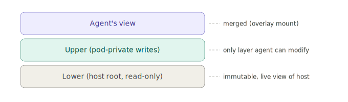

# envpod Security Model

This document describes envpod's security architecture at three levels: a simplified overview for decision-makers, a technical deep-dive for security engineers, and a threat model with known attack surface analysis.

---

## Part 1: Simplified Overview

### What envpod does

envpod places AI agents inside governed pods. A pod is an isolated environment where the agent believes it has full access to the system, but every action is captured, filtered, and reversible. Nothing the agent does reaches the real system unless a human approves it.

### The five isolation layers

**1. Filesystem — Copy-on-Write**

The agent sees your real filesystem but writes go to a private overlay. The host is never modified. You run `envpod diff` to review changes, `envpod commit` to apply them, or `envpod rollback` to discard everything.

**2. Network — Per-Pod DNS + Namespace**

Each pod has its own network stack. A per-pod DNS resolver filters which domains the agent can reach — whitelist, blacklist, or monitor mode. Every DNS query is logged.

**3. Process — Namespace + Syscall Filter**

The agent runs in its own PID namespace (can't see host processes), with a seccomp-BPF filter that allows only ~130 known-safe syscalls. Everything else returns "operation not permitted."

**4. Resources — cgroups v2**

CPU, memory, and process count are hard-capped. The agent can't consume more resources than allocated. The pod can be frozen or killed instantly via the cgroup freezer.

**5. Credentials — Encrypted Vault**

API keys are stored encrypted (ChaCha20-Poly1305) and injected at runtime. The agent never sees real credentials. With vault proxy enabled, a transparent HTTPS proxy intercepts requests and injects real auth headers — the agent only ever has dummy tokens.

### What the agent can't do

| Action | Prevented by |
|--------|-------------|
| Write to host filesystem | OverlayFS (writes go to overlay only) |
| See host processes | PID namespace |
| Access arbitrary network | Network namespace + DNS filtering |
| Call dangerous syscalls | seccomp-BPF allowlist |
| Exhaust host resources | cgroups v2 hard limits |
| Read real API keys | Encrypted vault + proxy injection |
| Tamper with audit log | Append-only log, written outside pod |
| Escalate privileges | `NO_NEW_PRIVS` + non-root uid + seccomp |

---

## Part 2: Technical Deep-Dive

### 2.1 Namespace Isolation

envpod creates three Linux namespaces per pod:

| Namespace | Flag | Purpose |
|-----------|------|---------|
| PID | `CLONE_NEWPID` | Agent is PID 1; host processes invisible |
| Mount | `CLONE_NEWNS` | Isolated filesystem view via OverlayFS |
| UTS | `CLONE_NEWUTS` | Pod-specific hostname |

Network isolation uses a pre-created network namespace (joined via `setns(CLONE_NEWNET)` in pre_exec).

**Not used:** User namespace (privilege dropping via `setuid()` instead — simpler, avoids UID remapping complexity). IPC namespace (low risk due to uid separation).

**Process launch flow (21 steps):**

1. Write PID to cgroup
2. Join network namespace via `setns()`
3. `unshare(CLONE_NEWNS | CLONE_NEWPID | CLONE_NEWUTS)`
4. Set pod hostname
5. Fork — parent becomes reaper (`waitpid` loop), child continues as PID 1
6. `setsid()` — new session, disconnect from host TTY
7. `TIOCSCTTY` — reclaim stdin as controlling terminal
8. Re-register in cgroup with new PID
9. `mount(NULL, "/", NULL, MS_REC | MS_PRIVATE)` — privatize all mounts
10. Mount OverlayFS (lower=host, upper=pod writes, merged=agent view)
11. Write `/etc/hostname`
12. Bind virtual filesystems (`/proc`, `/dev`, `/sys`, `/tmp`)
13. Mask `/proc` entries (cpuinfo, meminfo, sensitive files)
14. Mask GPU info (if GPU disabled)
15. Bind-mount extra paths from pod.yaml
16. Bind vault secrets to `/run/envpod/secrets.env` (read-only)
17. Bind action queue socket
18. `pivot_root(merged, merged/old_root)`
19. `umount2("/old_root", MNT_DETACH)` + `rmdir("/old_root")`
20. Drop privileges (coredump prevention, `setuid()`, `NO_NEW_PRIVS`)
21. Install seccomp-BPF filter (last step — all privileged ops complete)

### 2.2 Filesystem Isolation (OverlayFS)



**Rootfs structure at init:**

envpod creates a minimal rootfs with empty structural directories (`proc`, `dev`, `sys`, `tmp`, `home`, `opt`, `root`, `run`, `srv`, `mnt`, `media`, `boot`, `var`, `var/lib`, `var/cache`, `var/log`, `var/tmp`). `/etc` is copied (not bind-mounted) so agents can modify it via the overlay. The layout of `/bin`, `/sbin`, `/lib`, `/lib64` is replicated from the host — real directories become empty dirs, symlinks are preserved as symlinks.

**System access profiles:**

Three profiles control what agents can write to in system directories (`/usr`, `/bin`, `/sbin`, `/lib`, `/lib64`):

| Profile | System dirs | `envpod commit` behavior |
|---------|-------------|--------------------------|
| `safe` (default) | Read-only bind mounts from host (no writes possible) | N/A — nothing to commit |
| `advanced` | Per-dir COW overlays (`sys_upper/{dir}`) | Blocks system changes unless `--include-system` |
| `dangerous` | Per-dir COW overlays (`sys_upper/{dir}`) | Warns but allows system changes |

In `safe` mode, `/usr` is bind-mounted read-only, and any of `/bin`, `/sbin`, `/lib`, `/lib64` that are real directories (not symlinks to `/usr`) are also bind-mounted read-only. In `advanced`/`dangerous` modes, each system directory gets its own OverlayFS instance with a per-pod upper layer so agent writes are captured but the host is never modified.

**Host mounts (pod.yaml `filesystem.mounts`):**

Custom host paths can be bind-mounted into the pod:

```yaml
filesystem:
  mounts:
    - path: /data/models        # Read-only (default)
    - path: /shared/workspace
      permissions: readwrite     # Writable — bypasses COW for this path
```

Read-only mounts use `MS_BIND | MS_REC` followed by `MS_BIND | MS_REMOUNT | MS_RDONLY`. Read-write mounts are a direct bind — writes go to the host filesystem directly, **bypassing the overlay**. This is the only way for an agent to write to the host without `envpod commit`.

**Working directory mount (`mount_cwd`):**

When `filesystem.mount_cwd: true`, the caller's working directory at `envpod init` time is captured and bind-mounted into the pod at the same absolute path. Always mounted **read-only** with COW — agent writes go to the overlay.

**Host app auto-mount (`filesystem.apps`):**

```yaml
filesystem:
  apps: [python3, google-chrome, code]
```

For each app name, envpod resolves the binary via `which`, follows symlinks, runs `ldd` to identify shared library directories, and adds known data paths (e.g., `/opt/google` for Chrome, `/usr/lib/python3*` for Python). All resolved paths are mounted **read-only** with COW.

**Tracking configuration (diff/commit filtering):**

```yaml
filesystem:
  tracking:
    watch:                # Only changes under these prefixes appear in diff
      - /home
      - /workspace
    ignore:               # Always excluded from diff, even under watched paths
      - /var/cache
      - /tmp
```

Default watch paths (if empty): `/home`, `/opt`, `/root`, `/srv`, `/workspace`.
Default ignore paths (always): `/var/lib/apt`, `/var/lib/dpkg`, `/var/cache`, `/var/log`, `/tmp`, `/run`.

Filtering uses prefix matching: path must equal the prefix or start with `{prefix}/`. The watch filter is applied first (if non-empty), then the ignore filter. Use `--all` to bypass filtering entirely. Additionally, `/etc/resolv.conf` and `/opt/.envpod-setup.sh` are always excluded from commit.

**Clone host user (`host_user`):**

```yaml
host_user:
  clone_host: true
  # Optional overrides:
  # dirs: [Documents, Projects, src]
  # exclude: [.ssh, .gnupg]
  # include_dotfiles: [.config/nvim]
```

When enabled, envpod clones the host user into the pod (UID 60000, GID 60000) with:

*Dotfiles copied (COW):* `.bashrc`, `.bash_profile`, `.profile`, `.zshrc`, `.vimrc`, `.gitconfig`, `.tmux.conf`, `.inputrc`, plus `.config/nvim` by default.

*Home directories mounted (read-only COW):* `Documents`, `Desktop`, `Downloads`, `Pictures`, `Videos`, `Music`, `Projects`, `src`, `workspace` — or custom list via `dirs`.

*Always excluded by default* (sensitive credential directories):

| Path | Contains |
|------|----------|
| `.ssh` | SSH keys |
| `.gnupg` | GPG keys |
| `.aws` | AWS credentials |
| `.config/gcloud` | Google Cloud auth |
| `.config/google-chrome` | Chrome profile (cookies, passwords) |
| `.mozilla` | Firefox profile (cookies, passwords) |
| `.password-store` | Password manager vault |
| `.kube` | Kubernetes config |
| `.docker` | Docker config |
| `.netrc` | FTP/HTTP credentials |
| `.npmrc` | NPM auth tokens |
| `.pypirc` | PyPI auth tokens |
| `.gem/credentials` | Ruby gem auth tokens |

These exclusions can be overridden via `exclude` (replaces defaults). Additional dotfiles can be included via `include_dotfiles`.

All user directory mounts are read-only with COW — the agent sees the host user's files live but writes go to the overlay. The host home directory is never modified.

**Mount security summary:**

| Mount type | Default permission | Host writable? | COW protected? |
|-----------|-------------------|----------------|----------------|
| System dirs (safe) | Read-only bind | No | N/A |
| System dirs (advanced/dangerous) | COW overlay | No (overlay only) | Yes |
| Custom mounts (default) | Read-only bind | No | Yes (via overlay) |
| Custom mounts (readwrite) | Read-write bind | **Yes** | **No** |
| Working directory (mount_cwd) | Read-only bind | No | Yes |
| Host apps (filesystem.apps) | Read-only bind | No | Yes |
| Clone host user dirs | Read-only bind | No | Yes |
| Clone host dotfiles | Copied to rootfs | No | Yes |

**Virtual filesystem mounts:**

| Path | Type | Flags | Purpose |
|------|------|-------|---------|
| `/proc` | Fresh procfs | `MS_NOSUID\|MS_NODEV\|MS_NOEXEC` | Pod PID namespace only |
| `/dev` | Minimal tmpfs | `MS_NOSUID`, 5MB | Essential devices only |
| `/dev/shm` | tmpfs | `MS_NOSUID\|MS_NODEV` | Pod-private shared memory |
| `/sys` | Host bind | `MS_RDONLY` | Read-only system info |
| `/tmp` | Fresh tmpfs | 100MB, mode 1777 | Isolated temp space |

### 2.3 /proc Masking

Sensitive `/proc` entries are bind-mounted to `/dev/null` (read-only):

```
/proc/acpi          /proc/kcore         /proc/keys
/proc/latency_stats /proc/sched_debug   /proc/scsi
/proc/timer_list    /proc/sysrq-trigger
/proc/1/root        /proc/1/cwd         /proc/1/environ
```

Resource-reporting files are replaced with cgroup-accurate values:

| File | Masking method | Source of truth |
|------|---------------|-----------------|
| `/proc/cpuinfo` | Bind-mount staged file | `cpuset.cpus` — filtered/renumbered processors. Model name is always sanitized to "CPU" (prevents host CPU fingerprinting). |
| `/proc/meminfo` | Bind-mount staged file | `memory.max`, `memory.current`, `memory.stat`. When cgroup memory limits are set, values reflect cgroup limits instead of host totals. |
| `/sys/devices/system/cpu/` | tmpfs overlay | Only allowed `cpuN` directories visible |

`/proc/stat` is intentionally **not** masked — it provides live-updating CPU counters that tools like `htop` and `top` require for accurate CPU percentage display. A static bind-mount would freeze CPU percentages at the values from pod startup time.

CPU affinity is enforced via `sched_setaffinity()` so `nproc` reports the correct count.

### 2.4 Seccomp-BPF Syscall Filtering

**Architecture:** `seccompiler` crate builds a BPF program. Default action is `Errno(EPERM)` — blocked syscalls return "operation not permitted" (debuggable, not SIGKILL).

Architecture-aware: detects `x86_64` or `aarch64` at compile time. Some syscalls are x86_64-only (e.g., `open`, `stat`, `fork`, `pipe`, `poll`).

**Default profile (~130 syscalls):**

| Category | Syscalls |
|----------|----------|
| **File I/O** | `read`, `write`, `openat`, `close`, `stat`/`fstat`/`newfstatat`, `lseek`, `pread64`, `pwrite64`, `readv`, `writev`, `access`/`faccessat`, `dup`/`dup3`, `fcntl`, `flock`, `fsync`, `truncate`, `getdents64`, `getcwd`, `chdir`, `rename`/`renameat2`, `mkdir`/`mkdirat`, `rmdir`, `link`/`linkat`, `unlink`/`unlinkat`, `symlink`/`symlinkat`, `readlink`/`readlinkat`, `chmod`/`fchmod`, `chown`/`fchown`, `umask`, `statfs`, `utimensat`, `copy_file_range`, `sendfile`, `statx` |
| **Extended attrs** | `getxattr`, `lgetxattr`, `fgetxattr`, `listxattr`, `llistxattr`, `flistxattr` |
| **Memory** | `mmap`, `mprotect`, `munmap`, `brk`, `mremap`, `madvise`, `msync`, `mincore`, `mlock`/`mlock2`, `munlock`, `memfd_create`, `membarrier` |
| **Process** | `fork`, `vfork`, `clone`/`clone3`, `execve`/`execveat`, `exit`/`exit_group`, `wait4`/`waitid`, `getpid`/`getppid`/`gettid`, `getuid`/`geteuid`/`getgid`/`getegid`/`getgroups`, `setsid`, `setpgid`/`getpgid`, `prlimit64`, `getrusage`, `sched_yield`/`sched_getaffinity`/`sched_setaffinity`, `prctl`, `arch_prctl`, `rseq`, `set_tid_address`, `set_robust_list`/`get_robust_list` |
| **Credentials** | `capget`, `capset`, `setuid`, `setgid`, `setgroups`, `setresuid`, `setresgid`, `getresuid`, `getresgid` |
| **Signals** | `rt_sigaction`, `rt_sigprocmask`, `rt_sigreturn`, `rt_sigsuspend`, `rt_sigpending`, `rt_sigtimedwait`, `kill`, `tgkill`, `sigaltstack` |
| **Network** | `socket`, `connect`, `accept`/`accept4`, `bind`, `listen`, `sendto`, `recvfrom`, `sendmsg`/`recvmsg`, `sendmmsg`/`recvmmsg`, `shutdown`, `getsockname`, `getpeername`, `setsockopt`/`getsockopt`, `socketpair` |
| **Polling** | `poll`, `ppoll`, `select`, `pselect6`, `epoll_create1`, `epoll_ctl`, `epoll_wait`/`epoll_pwait`/`epoll_pwait2`, `eventfd2`, `signalfd4`, `timerfd_create`/`timerfd_settime`/`timerfd_gettime` |
| **Pipes** | `pipe`/`pipe2`, `splice`, `tee` |
| **Time** | `clock_gettime`, `clock_getres`, `clock_nanosleep`, `gettimeofday`, `nanosleep` |
| **inotify** | `inotify_init1`, `inotify_add_watch`, `inotify_rm_watch` |
| **Misc** | `uname`, `sysinfo`, `getrandom`, `futex`/`futex_waitv`/`futex_wake`/`futex_wait`/`futex_requeue`, `restart_syscall`, `ioctl`, `close_range` |

**Browser profile** adds 7 syscalls for Chromium compatibility:

| Syscall | Reason |
|---------|--------|
| `seccomp` | Chromium zygote installs its own BPF policy |
| `personality` | Chromium probes `READ_IMPLIES_EXEC` |
| `unshare` | Chromium renderer/GPU process namespace sandbox |
| `chroot` | Chromium sandbox isolation |
| `ptrace` | Chromium crash reporter + sandbox setup |
| `ioprio_get/set` | Disk cache I/O priority |
| `timer_create/settime/delete/gettime/getoverrun` | POSIX interval timers |

**Notably blocked** (not on allowlist):

| Syscall | Risk if allowed |
|---------|----------------|
| `mount`/`umount2` | Filesystem escape |
| `pivot_root`/`chroot` (default) | Root escape |
| `kexec_load` | Kernel replacement |
| `init_module`/`finit_module` | Kernel module loading |
| `reboot` | System shutdown |
| `settimeofday`/`clock_settime` | Time manipulation |
| `swapon`/`swapoff` | Swap manipulation |
| `acct` | Process accounting hijack |
| `quotactl` | Quota manipulation |
| `keyctl`/`request_key`/`add_key` | Kernel keyring access |
| `bpf` | eBPF program loading |
| `perf_event_open` | Performance monitoring (info leak) |
| `io_uring_setup`/`enter`/`register` | io_uring (large attack surface) |
| `userfaultfd` | Use-after-free exploitation |
| `process_vm_readv/writev` | Cross-process memory access |

### 2.5 Privilege Hardening

Applied in pre_exec, before seccomp (step 20):

```c
prctl(PR_SET_DUMPABLE, 0)          // Disable coredumps
setrlimit(RLIMIT_CORE, {0, 0})     // Zero core limit
prctl(PR_SET_NO_NEW_PRIVS, 1)      // Block suid/file-cap escalation
```

`NO_NEW_PRIVS` is set for **all pods** — both root and non-root. This flag is inherited across `fork()` and `execve()` and cannot be unset. It prevents any process in the pod from gaining privileges through setuid binaries, file capabilities, or any other mechanism.

Then privilege drop (non-root pods):

```c
// Collect supplementary groups (device owners: display, audio, GPU)
setgroups(groups)
setgid(gid)      // Default: 60000
setuid(uid)       // Default: 60000 (user "agent")
```

Capabilities are stripped implicitly — non-root UIDs have no capabilities by default in Linux. The seccomp filter allows `capget`/`capset` syscalls but the kernel enforces that non-root can't actually acquire capabilities.

**Privilege escalation prevention (sudo/su blocked):** Two independent layers prevent an agent from escalating from non-root to root inside a pod:

1. **NO_NEW_PRIVS flag** — causes `sudo` to refuse with "The no new privileges flag is set, which prevents acquiring new privileges" and causes setuid binaries (like `su`) to run without privilege gain.
2. **seccomp-BPF** — while `setuid`/`setgid` syscalls are in the allowlist (needed for the initial privilege drop), the combination of `NO_NEW_PRIVS` and non-root UID means the kernel rejects any attempt to escalate. The only way to run as root inside a pod is `envpod run --root` from the host.

### 2.6 Device Isolation

Default `/dev` is a minimal tmpfs (5MB) with only essential nodes:

| Device | Purpose |
|--------|---------|
| `null`, `zero`, `full` | Standard null/zero devices |
| `random`, `urandom` | Entropy sources |
| `tty`, `console` | Terminal access |
| `pts/*` | PTY allocation (bind from host) |
| `stdin`, `stdout`, `stderr` | Symlinks to `/proc/self/fd/` |

**Opt-in devices** (pod.yaml `devices` section):

| Category | Devices | Flag |
|----------|---------|------|
| **GPU (NVIDIA)** | `nvidia0-3`, `nvidiactl`, `nvidia-modeset`, `nvidia-uvm`, `nvidia-uvm-tools` | `devices.gpu: true` |
| **GPU (DRI)** | `dri/card0-1`, `dri/renderD128-129` | `devices.gpu: true` |
| **Audio (ALSA)** | `snd/controlC0-1`, `snd/pcmC*`, `snd/seq`, `snd/timer` | `devices.audio: true` |
| **Custom** | Any device path | `devices.extra: ["/dev/fuse"]` |

When GPU is disabled, GPU info paths are masked with empty read-only tmpfs overlays:
- `/proc/driver/nvidia`
- `/sys/module/nvidia`
- `/sys/class/drm`
- `/sys/bus/pci/drivers/nvidia`

### 2.7 Network Isolation

Each pod gets an isolated network namespace with a veth pair connecting it to the host:



**Subnet allocation:** `10.200.{idx}.0/30` — one /30 per pod (index 1-254). Kernel route collision check before allocation.

**iptables rules (host side):**

```
# Allow DNS from pod to host DNS server
-I INPUT -i veth-{id}-h -p udp --dport 53 -s 10.200.{idx}.0/30 -j ACCEPT
-I INPUT -i veth-{id}-h -p tcp --dport 53 -s 10.200.{idx}.0/30 -j ACCEPT

# Forward pod traffic to internet
-I FORWARD -i veth-{id}-h -o {host_iface} -s 10.200.{idx}.0/30 -j ACCEPT
-I FORWARD -i {host_iface} -o veth-{id}-h -m state --state RELATED,ESTABLISHED -j ACCEPT

# NAT outbound
-A POSTROUTING -s 10.200.{idx}.0/30 -o {host_iface} -j MASQUERADE
```

**iptables rules (pod side — DNS restriction):**

```
# Only allow DNS to the pod's assigned DNS server
-A OUTPUT -p udp --dport 53 -d {dns_ip} -j ACCEPT
-A OUTPUT -p tcp --dport 53 -d {dns_ip} -j ACCEPT
-A OUTPUT -p udp --dport 53 -j DROP
-A OUTPUT -p tcp --dport 53 -j DROP
```

IPv6 disabled in pod: `sysctl -w net.ipv6.conf.all.disable_ipv6=1`

IPv6 DNS rules applied as defense-in-depth (same pattern with `::ffff:` mapped addresses).

**Port forwarding scopes:**

| Scope | Visibility | iptables chain |
|-------|-----------|----------------|
| `-p` (localhost) | `127.0.0.1` only | OUTPUT DNAT + route_localnet |
| `-P` (public) | All interfaces | PREROUTING DNAT + FORWARD |
| `-i` (internal) | Pod-to-pod (`10.200.0.0/16`) | FORWARD only |

### 2.8 DNS Filtering

Per-pod embedded DNS resolver with three modes:

| Mode | Behavior | Use case |
|------|----------|----------|
| **Whitelist** | Only listed domains resolve; all others → NXDOMAIN | Locked-down agents |
| **Blacklist** | All domains resolve except listed | Block known-bad domains |
| **Monitor** | All domains resolve, all queries logged | Audit-only mode |

**Domain matching:** Case-insensitive suffix matching. `anthropic.com` matches `api.anthropic.com` and `a.b.c.anthropic.com`.

**Policy priority:** Remap > Allow/Deny.

**DNS remapping:** Redirect specific domains to different IPs (used by vault proxy to route bound domains to the MITM proxy).

**Anti-tunneling:** DNS queries are the only way for a pod to reach external DNS. All port-53 traffic except to the assigned resolver is dropped by iptables. The resolver logs every query with domain, type, decision, and latency.

### 2.9 Credential Vault

**Encryption:**
- Algorithm: ChaCha20-Poly1305 (AEAD)
- Key: 256-bit random per pod (OS CSPRNG via `OsRng`)
- Nonce: 12-byte random per encryption
- Wire format: `[12-byte nonce][ciphertext][16-byte Poly1305 tag]`

**File layout:**


`vault_env` is bind-mounted read-only into the pod at `/run/envpod/secrets.env`. Secrets are loaded as environment variables at pod start.

**Vault proxy (Premium):**

```
Agent → HTTPS request to api.anthropic.com
  ↓ DNS remap: api.anthropic.com → 10.200.{idx}.1 (host veth IP)
  ↓ Pod CA trusts proxy (ephemeral per-pod CA via rcgen)
Proxy → terminates TLS, reads SNI
  ↓ Strips agent's dummy auth header
  ↓ Injects real secret from vault
  ↓ Re-establishes TLS to real api.anthropic.com (webpki-roots trust store)
  ↓ Audit logs: domain + key name (never the secret value)
Upstream → real API response
  ↓ Proxy relays response back to agent
Agent ← response (never saw real credential)
```

### 2.10 Cgroups v2 Resource Limits

**Cgroup path:** `/sys/fs/cgroup/envpod/{pod-id}/`

| Controller | File | Example |
|-----------|------|---------|
| CPU | `cpu.max` | `200000 100000` (2 cores) |
| Memory | `memory.max` | `536870912` (512 MB) |
| PIDs | `pids.max` | `256` |
| CPU affinity | `cpuset.cpus` | `0-3` |
| NUMA | `cpuset.mems` | `0` |

**Freeze/kill:**
- Freeze: Write `1` to `cgroup.freeze`
- Thaw: Write `0` to `cgroup.freeze`
- Kill: `cgroup.kill` (kernel 5.14+), fallback to signal each PID

**Guardian mode (web display):** Split into `app/` and `guardian/` subcgroups. Display services (Xvfb, x11vnc, websockify) go to `guardian/`. Agent freezes don't kill the display.

### 2.11 Audit Log

**Format:** JSONL (one JSON object per line), append-only.

**Location:** `{pod_dir}/audit.jsonl` — outside the pod's overlay (agent can't access or modify).

**Entry structure:**
```json
{
  "timestamp": "2026-03-12T10:30:00Z",
  "pod_name": "my-agent",
  "action": "Commit",
  "detail": "paths=[/workspace/main.rs] target=host",
  "success": true
}
```

**Actions logged:** Create, Start, Stop, Kill, Destroy, Freeze, Resume, Clone, Diff, Commit, Rollback, Mount, Unmount, QueueSubmit, QueueApprove, QueueCancel, QueueBlock, QueueAutoExecute, VaultSet, VaultGet, VaultRemove, DnsQuery, MonitorAlert, MonitorFreeze, MonitorRestrict, ToolBlocked, BudgetExceeded, RemoteFreeze, RemoteResume, RemoteKill, RemoteRestrict, Undo, Restore, FileUpload.

**Tamper resistance:**
- Written outside pod overlay (agent has no access)
- Append-only semantics
- Single-line writes < `PIPE_BUF` (4096 bytes) — atomic on POSIX
- Incremental reads for live monitoring (`read_from(start_index)`)

### 2.12 Monitoring Agent

Background policy engine checks conditions every 5 seconds (configurable).

**Condition types:**
- `MaxActionsPerMinute { limit }` — rate limit on audit entries
- `ResourceThreshold { resource, max_percent }` — memory/CPU/PID percentage of cgroup limit
- `ForbiddenAction { action }` — specific audit action triggers response
- `ForbiddenSequence { actions, window_secs }` — ordered action sequence within time window

**Responses:**
- `Freeze` — freeze pod via cgroup freezer
- `Restrict { cpu_cores, memory_bytes, max_pids }` — reduce resource limits

Each trigger emits an audit entry (`MonitorAlert`) before executing the response.

### 2.13 Action Queue

Four reversibility tiers:

| Tier | Behavior |
|------|----------|
| `ImmediateProtected` | Executes immediately, reversible via COW overlay |
| `Delayed` | Auto-executes after timeout (default 30s) |
| `Staged` | Requires explicit `envpod approve` |
| `Blocked` | Denied outright by policy |

Persisted to `{pod_dir}/queue.json`. Background executor polls every 1 second for delayed actions.

---

## Part 3: Threat Model & Attack Surface

### 3.1 Threat Assumptions

**Attacker model:** A compromised or malicious AI agent running inside an envpod. The agent has:
- Full control of its own process (arbitrary code execution within the pod)
- Knowledge of the isolation mechanisms
- Motivation to escape the pod, exfiltrate data, or escalate privileges

**Trust boundary:** The pod boundary. Everything inside the pod is untrusted. Everything outside (host kernel, envpod binary, audit log, vault key) is trusted.

### 3.2 Attack Surface Analysis

#### A. Kernel Exploits (Namespace/Syscall Escape)

| Attack | Mitigation | Residual Risk |
|--------|-----------|---------------|
| Kernel vulnerability in allowed syscall | seccomp-BPF limits to ~130 syscalls; `NO_NEW_PRIVS` prevents suid escalation | Medium — kernel bugs in allowed syscalls (e.g., `ioctl`, `clone3`) could still be exploitable. This is shared attack surface with all container runtimes. |
| `ioctl` abuse (broad syscall) | Allowed without argument filtering | Medium — `ioctl` is a wide interface. Future: add seccomp argument filtering for specific ioctl commands. |
| `prctl` abuse | Allowed without argument filtering | Low — most dangerous prctl operations require `CAP_SYS_ADMIN` which non-root doesn't have. |
| `clone3` / `unshare` (default profile) | `unshare` blocked in default profile (allowed in browser profile for Chromium) | Low (default) / Medium (browser — Chromium needs it for its own sandbox). |
| Dirty pipe / Dirty COW variants | OverlayFS upper catches writes; host lower is read-only | Low — these attacks target the page cache, which is shared. OverlayFS provides some protection but kernel-level page cache attacks could theoretically bypass it. |

**Recommended hardening:** Run envpod on a hardened kernel with `lockdown=integrity`. Consider `io_uring` disabled in kernel config (already blocked by seccomp).

#### B. Filesystem Escape

| Attack | Mitigation | Residual Risk |
|--------|-----------|---------------|
| Write through OverlayFS to host | `pivot_root` + `umount2(old_root, MNT_DETACH)` — old root fully removed | Low — after pivot_root, old root is detached and unmounted. No path traversal reaches host. |
| Symlink escape from overlay upper | OverlayFS kernel driver handles symlinks in upper; `pivot_root` prevents following to host | Low |
| `/proc/1/root` traversal | Bind-mounted to `/dev/null` (read-only) | Low |
| Access host via `/proc/self/mountinfo` | Fresh procfs shows only pod mounts; no host paths visible | Low |
| Bind mount manipulation | `mount` syscall blocked by seccomp | None — can't mount |
| Write to host via readwrite mount | User-configured `permissions: readwrite` bypasses COW | Medium — readwrite mounts are the only way an agent writes directly to host. Users must understand this. Security audit flags readwrite mounts as finding. |
| Exfiltrate data via clone_host dirs | Home dirs mounted read-only; credential dirs excluded by default | Low — `.ssh`, `.gnupg`, `.aws`, `.docker`, `.kube`, `.npmrc`, `.pypirc`, `.netrc`, `.password-store`, `.config/gcloud`, `.mozilla`, `.config/google-chrome`, `.gem/credentials` all excluded. Custom `exclude` overrides defaults — user must ensure sensitive dirs remain excluded. |
| Read host dotfiles for recon | Dotfiles (`.bashrc`, `.gitconfig`, etc.) copied into pod rootfs | Low — these files are intended for agent use. `.gitconfig` may contain email/name (not credentials). `.bashrc` may contain env vars. |
| Bypass tracking filter to hide changes | Tracking only affects `diff`/`commit` display, not the overlay itself | Low — `envpod diff --all` always shows everything. Tracking is UX filtering, not a security boundary. |
| Write to system dirs (advanced/dangerous) | Writes go to `sys_upper/`, never host. `commit` requires `--include-system` (advanced) | Low — even in dangerous mode, writes never touch host without explicit `commit`. |
| Access host files via mount_cwd | CWD mounted read-only with COW | Low — agent can read CWD contents. Writes go to overlay. |
| Access host apps via filesystem.apps | App binaries + libraries mounted read-only | Low — read-only bind mounts. Agent can read but not modify. |

#### C. Network Escape / Data Exfiltration

| Attack | Mitigation | Residual Risk |
|--------|-----------|---------------|
| Direct DNS to external resolver | iptables DROP on all port-53 traffic except to assigned resolver | None — enforced at kernel level |
| DNS tunneling (encode data in queries) | All DNS queries logged; query type + domain visible in audit | Medium — data can be encoded in domain names (e.g., `base64data.evil.com`). Rate limiting and query length analysis would reduce this. Not yet implemented. |
| HTTP/HTTPS exfiltration | Only possible to allowed domains (whitelist mode) or all domains (blacklist/monitor mode) | Depends on DNS policy. In whitelist mode: low. In monitor mode: high (data sent to any allowed domain). |
| IPv6 escape | IPv6 disabled (`sysctl net.ipv6.conf.all.disable_ipv6=1`) + ip6tables rules | Low |
| Raw socket / ICMP tunneling | `socket` syscall allowed but pod network namespace prevents raw socket abuse | Low — raw sockets require `CAP_NET_RAW` which non-root doesn't have. |
| Pod-to-pod lateral movement | Discovery requires bilateral authorization; unauthorized pods get NXDOMAIN | Low — but pods on the same `10.200.0.0/16` subnet can technically attempt direct IP connections if they guess the IP. Mitigated: no way to enumerate other pod IPs from inside a pod. |

**Recommended hardening:** Enable whitelist DNS mode for high-security pods. Consider adding DNS query length/entropy analysis for anti-tunneling.

#### D. Credential Theft

| Attack | Mitigation | Residual Risk |
|--------|-----------|---------------|
| Read vault key from disk | `vault.key` is outside pod overlay; inaccessible after `pivot_root` | None |
| Read `/run/envpod/secrets.env` | Bind-mounted read-only — agent can read env vars (by design, for runtime injection) | Low — this is the intended injection point. Vault proxy mode eliminates this entirely. |
| Memory dump to extract secrets | `PR_SET_DUMPABLE=0` + `RLIMIT_CORE=0` — no coredumps | Low — `/proc/self/mem` is still accessible from within the pod. A malicious agent could read its own memory. For vault proxy mode: secrets are never in pod memory. |
| Intercept vault proxy TLS | Proxy uses ephemeral per-pod CA; agent doesn't have CA private key | Low — CA key is on host side only. Agent can't MITM the proxy. |
| Extract secrets from network traffic | Agent sees dummy tokens only (vault proxy mode) | None (proxy mode) / Medium (env var mode — agent has secrets in memory) |

**Recommended hardening:** Use vault proxy mode for sensitive credentials. Env var injection is suitable for development; proxy injection for production.

#### E. Privilege Escalation

| Attack | Mitigation | Residual Risk |
|--------|-----------|---------------|
| suid binary execution | `PR_SET_NO_NEW_PRIVS` — suid bit ignored | None |
| File capability escalation | `PR_SET_NO_NEW_PRIVS` — file caps ignored | None |
| `setuid(0)` from non-root | Kernel prevents: non-root can't `setuid(0)` | None |
| Capability manipulation | `capget`/`capset` allowed but non-root has empty capability sets | None — syscall succeeds but capability checks fail at kernel level |
| Exploit a root-owned suid binary in overlay | `NO_NEW_PRIVS` prevents any privilege gain from suid bits | None |

#### F. Resource Exhaustion / Denial of Service

| Attack | Mitigation | Residual Risk |
|--------|-----------|---------------|
| Fork bomb | `pids.max` cgroup limit | None — hard-capped |
| Memory exhaustion | `memory.max` cgroup limit + OOM killer scoped to cgroup | None — OOM kills pod processes, not host |
| CPU starvation | `cpu.max` quota/period | None — hard-capped |
| Disk exhaustion (fill overlay) | No explicit limit on overlay upper directory size | Medium — agent can fill the disk partition hosting the overlay. Consider: per-pod disk quotas via project quotas or overlay size limits. |
| Network bandwidth exhaustion | No per-pod bandwidth limiting (planned) | Medium — agent can saturate host network. Consider: tc qdisc rate limiting on veth. |

**Recommended hardening:** Place overlay storage on a separate partition or use filesystem quotas. Add `tc` bandwidth limits for network-intensive workloads.

#### G. Information Disclosure

| Attack | Mitigation | Residual Risk |
|--------|-----------|---------------|
| Read host processes via `/proc` | Fresh procfs — only pod PID namespace visible | None |
| Read host memory/CPU info | `/proc/cpuinfo` and `/proc/meminfo` masked with cgroup values | Low — `/proc/stat` is not masked (live-updating). Agent can see aggregate host CPU statistics. |
| Read kernel keys/kcore | Masked to `/dev/null` | None |
| Read GPU info when disabled | Masked with empty tmpfs | None |
| Enumerate host network interfaces | Network namespace — only veth visible | None |
| Side-channel attacks (cache timing) | Not mitigated | High — no cache partitioning (CAT/MBA) implemented. CPU affinity provides some isolation but shared L3 cache is vulnerable to Spectre-class attacks. Planned for future. |
| Host environment variables | Pivot_root removes access; `/proc/1/environ` masked | None |

**Recommended hardening:** Enable CPU affinity (`processor.affinity`) to reduce cache-sharing surface. Cache partitioning (Intel CAT) planned for future versions.

#### H. Audit Log Tampering

| Attack | Mitigation | Residual Risk |
|--------|-----------|---------------|
| Modify audit log | Log is outside pod overlay; inaccessible after `pivot_root` | None |
| Suppress audit entries | Audit writes happen in the host-side envpod process, not the pod | None — agent can't prevent logging |
| Flood audit with noise | MaxActionsPerMinute monitoring rule can detect and freeze | Low — agent can generate many actions before being frozen (5-second check interval) |

#### I. Container Escape via Misconfiguration

| Attack | Mitigation | Residual Risk |
|--------|-----------|---------------|
| `devices.extra: ["/dev/sda"]` | User's responsibility — envpod binds whatever is configured | High — block device access enables filesystem manipulation. Security audit flags this (I-06). |
| `security.seccomp_profile: none` | Disables all syscall filtering | Critical — only for debugging. Security audit flags this (S-03). |
| `user: root` | Pod runs as root inside namespace | Medium — root has capabilities within the pod's namespace. Combined with any kernel vulnerability, escape risk increases. |
| `permissions: readwrite` on mounts | Read-only by default; writable only if explicitly configured | Medium — writable bind mounts bypass COW. Agent can write directly to host for those paths. Security audit flags this. |
| `system_access: dangerous` | System dir changes allowed at commit | Low — writes still go to overlay; `commit` is explicit. But user may accidentally commit system changes. |
| `host_user.exclude` overriding defaults | Default excludes `.ssh`, `.gnupg`, `.aws`, etc. | Medium — if user overrides `exclude` with a custom list, default credential exclusions are replaced. User must ensure sensitive dirs remain excluded. |
| `clone_host: true` with `include_dotfiles` | User can include arbitrary dotfiles | Low — dotfiles may contain tokens or secrets (e.g., `.env`, `.netrc`). Include list is user-controlled. |
| `filesystem.tracking.watch: []` (empty) | Empty watch list means "watch everything" | Low — tracking is UX filtering only. `diff --all` and `commit --all` always see everything regardless. |

### 3.3 Comparison to Other Isolation Technologies

| Feature | envpod | Docker (default) | gVisor | Firecracker |
|---------|--------|-------------------|--------|-------------|
| Kernel shared with host | Yes | Yes | No (user-space kernel) | No (separate kernel) |
| Syscall filtering | seccomp-BPF (~130 allowed) | seccomp-BPF (~300 allowed) | Intercepts all syscalls | N/A (separate kernel) |
| Filesystem reversibility | OverlayFS COW + diff/commit/rollback | None (union mount) | None | None |
| /proc masking | cpuinfo, meminfo, sensitive files | Partial (AppArmor profile) | Full (synthetic /proc) | Full (separate /proc) |
| Credential isolation | Encrypted vault + proxy injection | Env vars (plaintext) | Env vars (plaintext) | Env vars (plaintext) |
| DNS filtering | Per-pod embedded resolver | None (host DNS) | None (host DNS) | None |
| Audit trail | Per-action JSONL log | Container logs only | None | None |
| Action approval queue | 4-tier reversibility model | None | None | None |
| Side-channel resistance | CPU affinity (partial) | None | Moderate (user-space kernel) | Strong (separate kernel) |
| Escape risk | Medium (shared kernel) | Medium (shared kernel) | Low (user-space kernel) | Very low (separate kernel) |

### 3.4 Security Invariants

These properties must always hold. A violation of any invariant is a security bug:

1. **Filesystem isolation:** No agent write reaches the host filesystem without explicit `envpod commit`.
2. **Process isolation:** No host process is visible inside a pod. No pod process can signal a host process.
3. **Network isolation:** All pod DNS queries pass through the per-pod DNS resolver. No direct external DNS resolution is possible.
4. **Credential isolation:** In vault proxy mode, real credentials never exist inside the pod's memory or filesystem.
5. **Audit completeness:** Every `commit`, `rollback`, `vault` access, `queue` action, and `remote control` operation generates an audit entry.
6. **Privilege boundary:** After pre_exec completes, the pod process runs as non-root with `NO_NEW_PRIVS` and seccomp-BPF active. No code path allows re-acquiring root privileges.
7. **Resource containment:** Pod resource usage cannot exceed cgroup limits. OOM kills are scoped to the pod's cgroup.

### 3.5 Known Limitations

1. **Shared kernel** — envpod relies on the host kernel for isolation. A kernel exploit in any allowed syscall can potentially escape the pod. This is inherent to all container-based isolation (Docker, LXC, etc.). For stronger isolation, use the VM backend (planned — Firecracker/QEMU).

2. **No overlay disk quota** — Agent can fill the host partition by writing to the overlay. Mitigation: monitor disk usage, use a separate partition, or enable filesystem project quotas.

3. **No network bandwidth limiting** — Agent can saturate the host network. Mitigation: tc qdisc rate limiting on veth (planned).

4. **No cache partitioning** — Shared L3 cache enables Spectre-class side channels between pods and between pods and host. Mitigation: CPU affinity reduces but doesn't eliminate this. Intel CAT support planned.

5. **`/proc/stat` not masked** — Agent can see aggregate host CPU statistics. Low-risk information disclosure.

6. **IPC namespace not isolated** — SYSV shared memory segments visible across pods. Mitigated by uid separation (different uids can't attach to each other's segments).

7. **Two seccomp profiles only** — Default and Browser. No custom per-pod profiles yet. Planned.

8. **Single-host only** — No cross-host isolation guarantees. Pod-to-pod discovery is host-local. Remote fleet management planned for Enterprise tier.

### 3.6 Recommended Host Hardening

envpod's seccomp filter blocks dangerous syscalls (`kexec_load`, `bpf`, `perf_event_open`, `init_module`, etc.), but these are userspace restrictions — a seccomp bypass would restore access. The following kernel-level protections enforce the same restrictions independently, so even a seccomp bypass is not sufficient for exploitation.

**Kernel boot parameters:**

```
# /etc/default/grub (then run update-grub && reboot)
GRUB_CMDLINE_LINUX="lockdown=confidentiality nosmt vsyscall=none"
```

| Parameter | What it does | Why it matters |
|-----------|-------------|---------------|
| `lockdown=integrity` | Blocks unsigned kernel modules, `/dev/mem` writes, `kexec_load`, eBPF kernel writes, hibernation | Kernel self-protection — even root cannot modify the running kernel |
| `lockdown=confidentiality` | Everything in `integrity` + blocks `/dev/mem` reads, `perf_event_open`, debugfs/tracefs, raw PCI reads | Prevents kernel memory disclosure — raises the bar for information leaks needed to build exploits |
| `nosmt` | Disables hyperthreading (simultaneous multithreading) | Eliminates Spectre v2 / Branch History Injection attacks via sibling hyperthreads. Costs ~20-30% throughput on HT-capable CPUs. |
| `vsyscall=none` | Removes the legacy vsyscall page | ASLR hardening — removes a fixed-address page that attackers use for ROP gadgets |

**Relationship to envpod's seccomp:**

envpod's seccomp already blocks `kexec_load`, `bpf`, `perf_event_open`, `init_module`, and `finit_module`. Kernel lockdown enforces the same restrictions at a deeper level. The two are complementary — seccomp is the first barrier (userspace), lockdown is the second (kernel). An attacker must bypass both.

**Isolation backend hierarchy (planned):**

For environments where the shared kernel is an unacceptable risk, envpod's pluggable backend architecture supports stronger isolation:

| Backend | Kernel exposure | Boot time | Use case |
|---------|----------------|-----------|----------|
| `native` | Shared host kernel, ~130 allowed syscalls | ~32ms | Development, coding agents |
| `native` + lockdown | Shared, kernel self-protected | ~32ms | Production, sensitive workloads |
| `docker` | Shared (container runtime) | ~500ms | Existing Docker infrastructure |
| `vm` (Firecracker) | **Separate kernel per pod** | ~125ms | Untrusted agents, multi-tenant, compliance |

All backends run the same governance layer — diff/commit/rollback, vault, DNS filtering, audit, action queue. The isolation strength changes; the governance is constant.

---

## Part 4: Pod Configuration Security Reference

Every field in `pod.yaml` has security implications. This section documents the complete configuration schema with risk annotations. Fields marked with a security icon have direct security impact.

### 4.1 Top-Level Fields

```yaml
name: my-agent                    # Pod identifier
type: standard                    # standard | hardened | ephemeral | supervised | air_gapped
backend: native                   # native (only option in v0.1)
user: agent                       # Default non-root user (UID 60000)
start_command: [sleep, infinity]  # Default command for `envpod start`
setup:                            # Shell commands run during `envpod init` (as root)
  - apt-get update && apt-get install -y curl
setup_script: /path/to/script.sh  # Host-side script injected and run during setup
```

| Field | Default | Security implication |
|-------|---------|---------------------|
| `name` | (required) | Used in DNS discovery (`<name>.pods.local`), cgroup path, audit log. Avoid names that could confuse log analysis. |
| `type` | `standard` | `air_gapped` disables all network access. `hardened` applies stricter defaults. `ephemeral` auto-destroys on exit. |
| `user` | `agent` | **Non-root (UID 60000).** Setting `user: root` runs the agent as root inside the namespace — capabilities are available, privilege escalation risk increases. Security audit flags this (P-03). |
| `setup` | `[]` | Commands run as root during init. Arbitrary code execution on the pod filesystem. Review setup commands for supply chain attacks (e.g., `curl | bash` from untrusted sources). |
| `setup_script` | none | Host file injected into pod. Ensure the script is trusted — it runs as root during setup. |

### 4.2 Filesystem

```yaml
filesystem:
  system_access: safe             # safe | advanced | dangerous
  mount_cwd: false                # Mount caller's CWD (read-only + COW)
  apps:                           # Auto-resolve and bind-mount host binaries
    - python3
    - git
  mounts:                         # Custom host path mounts
    - path: /data/models          # Read-only by default
    - path: /shared/workspace
      permissions: readwrite      # ⚠ Direct host write access
  tracking:
    watch: [/home, /workspace]    # Only show these in diff (prefix match)
    ignore: [/var/cache, /tmp]    # Always hide from diff
```

| Field | Default | Security implication |
|-------|---------|---------------------|
| `system_access` | `safe` | **Controls system directory mutability.** `safe`: read-only bind mounts (strongest). `advanced`: COW overlays, commit blocked unless `--include-system`. `dangerous`: COW overlays, commit warns but allows. Even in `dangerous`, writes never reach host without explicit `commit`. |
| `mount_cwd` | `false` | Mounts caller's working directory read-only with COW. Agent can read all files in the directory. Ensure CWD doesn't contain secrets (`.env` files, credentials). |
| `apps` | `[]` | Resolves binary + shared libraries + data dirs via `which`/`ldd`. All mounted read-only. Agent can read application binaries and libraries but not modify them. |
| `mounts[].path` | (required) | **Read-only by default** — agent sees host files live but writes go to overlay. |
| `mounts[].permissions` | `ReadOnly` | **`readwrite` bypasses COW protection.** Agent writes go directly to the host filesystem for this path. This is the only mechanism that allows an agent to modify host files without `envpod commit`. Use with extreme caution. |
| `tracking.watch` | `/home, /opt, /root, /srv, /workspace` | UX filtering only — controls what `envpod diff` shows. **Not a security boundary.** `diff --all` and `commit --all` always see everything. |
| `tracking.ignore` | `/var/lib/apt, /var/lib/dpkg, /var/cache, /var/log, /tmp, /run` | Same as watch — UX only. Ignored paths still exist in the overlay and can be committed with `--all`. |

### 4.3 Network

```yaml
network:
  mode: isolated                  # isolated | monitored | unsafe
  subnet: "10.200"               # Pod IP base (10.200.{idx}.0/30)
  dns:
    mode: whitelist               # whitelist | blacklist | monitor
    allow:                        # Domains allowed (whitelist mode)
      - api.anthropic.com
      - github.com
    deny:                         # Domains blocked (blacklist mode)
      - evil.com
    remap:                        # DNS remapping (domain → IP)
      internal.api.com: "10.0.0.5"
  ports: ["8080:3000"]           # Localhost-only port forwarding
  public_ports: ["443:443"]      # ⚠ All-interface port forwarding
  internal_ports: ["5432"]       # Pod-to-pod only (10.200.0.0/16)
  bandwidth_cap: "1GB"           # Max bandwidth per session
  rate_limit: "100"              # Max requests per minute
  allow_discovery: false         # Register as <name>.pods.local
  allow_pods: []                 # Pods this pod can discover
```

| Field | Default | Security implication |
|-------|---------|---------------------|
| `mode` | `isolated` | **`isolated`: no network at all** (safest). `monitored`: network with DNS filtering and logging. `unsafe`: unrestricted host network — agent has full network access. Security audit flags `unsafe` (N-04, High severity). |
| `dns.mode` | `monitor` | **`whitelist`: strongest** — only listed domains resolve, everything else NXDOMAIN. `blacklist`: all domains except listed. `monitor`: all domains resolve, queries logged only. For sensitive workloads, always use `whitelist`. |
| `dns.allow` | `[]` | Whitelist entries. Suffix-matched: `anthropic.com` allows `api.anthropic.com`. Empty list in whitelist mode = nothing resolves (effective air gap). |
| `dns.deny` | `[]` | Blacklist entries. Same suffix matching. |
| `dns.remap` | `{}` | Redirects domain resolution to a different IP. Used by vault proxy to intercept HTTPS traffic. Can also be used to redirect agents to internal services. |
| `ports` | `[]` | **Localhost-only** (`127.0.0.1`). Only the host machine can access these ports. Format: `host_port:container_port[/proto]`. |
| `public_ports` | `[]` | **All interfaces** — accessible from any machine on the network. Security audit flags this (N-03). Use only when external access is intended. |
| `internal_ports` | `[]` | **Pod-to-pod only** (`10.200.0.0/16` subnet). Not accessible from host or external network. Requires pod discovery for the connecting pod to find this pod's IP. |
| `allow_discovery` | `false` | Registers pod in the central DNS daemon as `<name>.pods.local`. Other pods can resolve this name only if they have this pod in their `allow_pods`. **Bilateral enforcement.** |
| `allow_pods` | `[]` | Pods this pod is allowed to discover. `["*"]` allows discovering all pods — security audit flags this (N-05). Empty = cannot discover any other pod. |

### 4.4 Processor (Resource Limits)

```yaml
processor:
  cores: 2.0                     # CPU core limit (cgroup cpu.max)
  memory: "4GB"                  # Memory limit (cgroup memory.max)
  cpu_affinity: "0-3"            # Pin to specific CPUs (cpuset.cpus)
  max_pids: 512                  # Process/thread limit (cgroup pids.max)
```

| Field | Default | Security implication |
|-------|---------|---------------------|
| `cores` | unlimited | **No limit = agent can consume all host CPU.** Set this in production to prevent CPU starvation of other pods and host services. |
| `memory` | unlimited | **No limit = agent can trigger host OOM killer.** Always set a memory limit. Supports: `"512MB"`, `"2GB"`, `"1.5GB"`. |
| `cpu_affinity` | none | Pins pod to specific CPUs. Provides some side-channel isolation (separate L1/L2 caches). Does not prevent L3 cache attacks. |
| `max_pids` | unlimited | **No limit = fork bomb can exhaust host PID space.** Set `max_pids` to prevent fork bombs. Typical: 256-2048. |

### 4.5 Security

```yaml
security:
  seccomp_profile: default        # default | browser | none
  shm_size: "256MB"              # /dev/shm size (default 64MB)
```

| Field | Default | Security implication |
|-------|---------|---------------------|
| `seccomp_profile` | `default` | **`default`: ~130 allowed syscalls** (recommended). `browser`: adds 7 syscalls for Chromium (`ptrace`, `unshare`, `chroot`, `seccomp`, `personality`, `ioprio_*`, POSIX timers). `none`: **disables all syscall filtering** — agent can call any syscall. Only for debugging. Security audit flags `none` (S-03). |
| `shm_size` | `64MB` | Size of `/dev/shm` tmpfs. Chromium requires at least 64MB. Larger values allow more shared memory IPC. Not a direct security risk but affects memory accounting. |

### 4.6 Devices

```yaml
devices:
  gpu: false                     # NVIDIA + DRI device access
  display: false                 # Host display socket passthrough
  audio: false                   # Host audio socket + /dev/snd
  display_protocol: auto         # auto | wayland | x11
  audio_protocol: auto           # auto | pipewire | pulseaudio
  desktop_env: none              # none | xfce | openbox | sway
  extra: []                      # ⚠ Arbitrary device paths
```

| Field | Default | Security implication |
|-------|---------|---------------------|
| `gpu` | `false` | Binds NVIDIA devices (`nvidia0-3`, `nvidiactl`, `nvidia-uvm`) and DRI devices (`dri/card0-1`, `dri/renderD128-129`). GPU compute is possible. GPU memory is shared with host — no isolation between pods sharing GPU. |
| `display` | `false` | Bind-mounts host display socket (Wayland or X11). **X11 is insecure** — allows keylogging, screenshots, and window manipulation of other X11 clients. Wayland is client-isolated. |
| `audio` | `false` | Bind-mounts audio socket + `/dev/snd/*`. PulseAudio allows microphone access by default. PipeWire has finer-grained permission controls. |
| `display_protocol` | `auto` | `auto` prefers Wayland (secure). Forcing `x11` reduces security (shared input/output with all X11 clients). |
| `desktop_env` | `none` | `xfce`/`openbox`/`sway` install a desktop environment during setup. These run inside the pod and are isolated. Sway is Wayland-native (most secure). |
| `extra` | `[]` | **Arbitrary device paths.** `["/dev/sda"]` gives raw disk access. `["/dev/kvm"]` gives VM access. No validation — user must understand what they're exposing. Security audit flags dangerous devices (I-06). |

### 4.7 Web Display

```yaml
web_display:
  type: none                     # none | novnc | webrtc
  port: 6080                     # Host port for browser access
  resolution: "1280x720"         # Virtual display resolution
  audio: false                   # Audio streaming
  audio_port: 6081               # Audio WebSocket port
  file_upload: true              # Upload button in noVNC panel
  upload_port: 5080              # Upload server port
```

| Field | Default | Security implication |
|-------|---------|---------------------|
| `type` | `none` | `novnc`: VNC over WebSocket — unencrypted by default (plain HTTP). Use `ports` (localhost-only) to limit access. `webrtc`: DTLS-encrypted, but requires more setup. |
| `port` | `6080` | Bound on host. If combined with `public_ports`, anyone on the network can view the desktop. Use `ports` (localhost-only) for security. |
| `file_upload` | `true` | Allows uploading files from browser to `/tmp/uploads/` inside pod. Files are in the overlay — no host impact. Upload events are audit-logged. |
| `audio` | `false` | Audio streaming over WebSocket (unencrypted). Low risk — audio from virtual display, not host microphone. |

### 4.8 Vault

```yaml
vault:
  proxy: false                   # Transparent HTTPS credential proxy
  bindings:                      # Secret → domain → header mappings
    - secret: ANTHROPIC_API_KEY
      domain: api.anthropic.com
      header: x-api-key
```

| Field | Default | Security implication |
|-------|---------|---------------------|
| `proxy` | `false` | **When false:** secrets injected as environment variables via `/run/envpod/secrets.env`. Agent can read them. **When true:** transparent HTTPS MITM proxy injects real credentials. Agent only sees dummy tokens — real keys never enter pod memory or filesystem. Proxy mode is strictly more secure. |
| `bindings` | `[]` | Maps vault secrets to HTTP headers for specific domains. The proxy intercepts HTTPS to the bound domain, strips the agent's auth header, and injects the real secret. Domain matching is exact (not suffix). |

### 4.9 Budget & Tools

```yaml
budget:
  max_duration: "2h"             # Time limit (auto-kill)
  max_requests: 10000            # API request cap
  max_bandwidth: "5GB"           # Bandwidth cap

tools:
  allowed_commands: []           # Command whitelist (empty = all allowed)
```

| Field | Default | Security implication |
|-------|---------|---------------------|
| `max_duration` | unlimited | Kills pod after time limit. Prevents runaway agents from consuming resources indefinitely. Supports: `"30m"`, `"2h"`, `"1h30m"`. |
| `max_requests` | unlimited | Caps API calls. Prevents cost explosion from agent loops. |
| `allowed_commands` | `[]` (all) | **Empty = all commands allowed.** When set, only listed commands can be executed. Basenames (e.g., `python3`) or full paths (e.g., `/usr/bin/git`). |

### 4.10 Queue & Audit

```yaml
queue:
  socket: false                  # Mount action queue socket in pod
  require_commit_approval: false # Human approval for commits
  require_rollback_approval: false

audit:
  action_log: true               # Log all pod actions
  system_trace: false            # Syscall tracing (expensive)
```

| Field | Default | Security implication |
|-------|---------|---------------------|
| `queue.socket` | `false` | When true, mounts Unix socket at `/run/envpod/queue.sock`. Agent can submit actions to the queue programmatically. Actions still subject to tier enforcement. |
| `queue.require_commit_approval` | `false` | **When true:** `envpod commit` stages the action instead of executing. Human must `envpod approve` before changes reach host. Strongest governance for filesystem changes. |
| `audit.action_log` | `true` | Disabling this removes the audit trail. Not recommended — audit log is the only record of what happened inside the pod. |

### 4.11 Snapshots & Host User

```yaml
snapshots:
  auto_on_run: false             # Auto-snapshot before each run
  max_keep: 10                   # Max auto-snapshots (manual never pruned)

host_user:
  clone_host: false              # Clone host user into pod
  dirs: []                       # Home dirs to mount (default: Documents, Downloads, etc.)
  exclude: []                    # Dirs to exclude (default: .ssh, .gnupg, .aws, etc.)
  include_dotfiles: []           # Extra dotfiles to include
```

| Field | Default | Security implication |
|-------|---------|---------------------|
| `snapshots.auto_on_run` | `false` | When true, creates a snapshot of the overlay before each `envpod run`. Enables point-in-time recovery. Snapshots are stored outside the pod overlay — agent can't access or delete them. |
| `host_user.clone_host` | `false` | **Clones host user (UID 60000) with COW home directory.** Agent can read dotfiles (`.bashrc`, `.gitconfig`, `.vimrc`, etc.) and home directories. All read-only with COW. |
| `host_user.exclude` | `.ssh, .gnupg, .aws, .docker, .kube, .config/gcloud, .mozilla, .config/google-chrome, .password-store, .netrc, .npmrc, .pypirc, .gem/credentials` | **Overrides replace defaults entirely.** If you set `exclude: [.cache]`, the default credential exclusions are removed. Always include sensitive dirs in your custom list. |
| `host_user.include_dotfiles` | `[]` | Add dotfiles beyond the defaults (`.bashrc`, `.bash_profile`, `.profile`, `.zshrc`, `.vimrc`, `.gitconfig`, `.tmux.conf`, `.inputrc`). Be careful with `.env`, `.netrc`, or config files containing tokens. |

### 4.12 Security Audit Findings by Config

`envpod audit --security` performs static analysis of pod.yaml and flags risky configurations:

| Finding | Severity | Trigger | Recommendation |
|---------|----------|---------|----------------|
| N-03 | Medium | `public_ports` is non-empty | Use `ports` (localhost-only) unless external access is required |
| N-04 | High | `network.mode: unsafe` | Use `monitored` with DNS whitelist instead |
| N-05 | Medium | `allow_pods: ["*"]` | List specific pod names |
| N-06 | Medium | `dns.mode: blacklist` | Use `whitelist` for sensitive workloads |
| V-01 | Medium | No vault secrets configured | Add credentials to vault for governed injection |
| V-02 | Medium | `vault.proxy: false` with secrets | Enable proxy to keep secrets out of pod memory |
| V-03 | Medium | Vault bindings without proxy | Enable `vault.proxy: true` for binding enforcement |
| S-03 | Low | `seccomp_profile: none` | Use `default` or `browser` profile |
| P-03 | Low | `user: root` | Use default `agent` user (UID 60000) |
| I-04 | Info | No resource limits set | Set `processor.cores`, `memory`, `max_pids` |
| I-05 | Info | No CPU affinity | Set `cpu_affinity` for cache isolation |
| I-06 | Low | `devices.extra` contains block/char devices | Review extra device list for sensitive access |
| C-01 | Info | No budget limits | Set `budget.max_duration` and `max_requests` |
| C-02 | Info | `audit.action_log: false` | Enable action logging |
| C-03 | Info | No tracking config | Set `tracking.watch` to scope diff output |

---

## Part 5: Display, Audio & Web Display Security

### 5.1 Display Passthrough (Host Display)

When `devices.display: true`, the host display socket is bind-mounted read-only into the pod:

| Protocol | Socket path | Mount flags | Security model |
|----------|------------|-------------|----------------|
| **Wayland** | `/tmp/wayland-0` (or `$WAYLAND_DISPLAY`) | Read-only bind | Client-isolated — each client gets its own surface. Cannot read other clients' input or output. Compositor enforces isolation. |
| **X11** | `/tmp/.X11-unix/X0` (or `$DISPLAY`) | Read-only bind | **Not isolated** — any X11 client can read keystrokes, take screenshots, and manipulate windows of all other X11 clients on the same display. |

**X11 risks:**
- Keylogging via `XQueryKeymap` or `XRecord` extension
- Screenshot capture via `XGetImage` on root window
- Window manipulation via `XSendEvent`, `XMoveResizeWindow`
- Clipboard sniffing via X selection protocol

**Recommendation:** Use Wayland (`display_protocol: wayland`) or web display (`web_display.type: novnc`) instead of X11 passthrough. If X11 is required, run only trusted applications alongside the agent.

**Auto-detection order:** `auto` checks for Wayland socket first, falls back to X11. This prefers the more secure protocol.

### 5.2 Audio Passthrough (Host Audio)

When `devices.audio: true`, the host audio socket is bind-mounted into the pod:

| Protocol | Socket path | Mount flags | Security model |
|----------|------------|-------------|----------------|
| **PipeWire** | `/tmp/pipewire-0` (or `$PIPEWIRE_REMOTE`) | Read-only bind | Permission-based — PipeWire can restrict which streams a client can access. By default, playback and capture are both allowed. |
| **PulseAudio** | `/tmp/pulse-native` (or `$PULSE_SERVER`) | Read-only bind | **No per-client isolation** — any PulseAudio client can record from any source, including the microphone. |

**PulseAudio risks:**
- Microphone access without user consent — agent can record ambient audio
- Monitor source recording — agent can capture audio output from other applications
- Volume manipulation — agent can mute or change system volume

**PipeWire risks (lower):**
- Default configuration still allows capture — but PipeWire supports per-client permission policies (not enforced by envpod yet)

**Recommendation:** For untrusted agents, avoid `devices.audio: true`. Use web display audio instead (`web_display.audio: true`), which uses a virtual PulseAudio sink inside the pod — no access to host microphone or other applications' audio.

### 5.3 Web Display (noVNC)

When `web_display.type: novnc`, envpod runs a virtual display stack entirely inside the pod:



**All services run inside the pod's namespaces.** The host display, host audio, and host X11 are never touched. The agent gets a completely isolated virtual display.

**Network exposure:**

| Service | Default port | Protocol | Encryption | Bound to |
|---------|-------------|----------|------------|----------|
| noVNC | 6080 | HTTP + WebSocket | **None (plain HTTP)** | `0.0.0.0` inside pod, forwarded via `ports` |
| Audio | 6081 | WebSocket | **None** | `0.0.0.0` inside pod |
| Upload | 5080 | HTTP | **None** | `0.0.0.0` inside pod |

**Security implications:**

| Risk | Details | Mitigation |
|------|---------|-----------|
| Unencrypted VNC stream | Screen content visible to anyone who can reach the port | Use `ports` (localhost-only) to limit to `127.0.0.1`. Do not use `public_ports` for web display unless behind a reverse proxy with TLS. |
| No VNC authentication | noVNC connects without password by default | Port-level access control only. Localhost binding is the primary protection. |
| File upload to pod | Browser users can upload files to `/tmp/uploads/` | Files land in the overlay — no host impact. Uploads are audit-logged (`AuditAction::FileUpload`). Disable with `web_display.file_upload: false`. |
| Clipboard sync requires HTTPS | `navigator.clipboard` API needs secure context | Pod-to-browser clipboard works via noVNC sidebar panel (VNC-native). Automatic clipboard sync only works over `https://` or `localhost`. |
| Agent can see VNC screen | Agent shares the virtual display | By design — this is how GUI agents interact. The display is pod-private, not shared with host. |
| X11 inside pod is insecure | Xvfb is X11-based — applications inside the pod can keylog each other | Acceptable — all applications inside the pod are untrusted by definition. The isolation boundary is the pod, not the X11 server within it. |

**Guardian mode (cgroup split):**

Display services (Xvfb, x11vnc, websockify, PulseAudio, upload server) are migrated to a `guardian/` subcgroup. The agent process runs in the `app/` subcgroup. This allows:
- Freezing the agent without killing the display (screen stays visible)
- Resource limits apply to both subcgroups under the parent cgroup
- `envpod lock` freezes agent; display services keep running for observation

**D-Bus isolation:**

Web display pods run their own `dbus-daemon --session` with a permissive config (`allow_anonymous`, no auth). This D-Bus instance is pod-private (not connected to host D-Bus). Desktop environments like XFCE require a session bus — this provides it without leaking host D-Bus messages.

### 5.4 Web Display (WebRTC)

When `web_display.type: webrtc`, the display stack uses GStreamer for low-latency video + audio:

```
Xvfb :99 → ximagesrc → VP8/H.264 encode → WebRTC → Browser
PulseAudio → opusenc → WebRTC audio track → Browser
```

**Security differences from noVNC:**

| Property | noVNC | WebRTC |
|----------|-------|--------|
| Transport encryption | None (plain HTTP) | **DTLS-SRTP** (encrypted by default) |
| Video codec | VNC framebuffer (lossless) | VP8 or H.264 (lossy, compressed) |
| Audio transport | Separate WebSocket (unencrypted) | Integrated audio track (encrypted) |
| Latency | 50-100ms | 20-50ms |
| Browser requirements | Any (WebSocket support) | Modern browser (WebRTC support) |
| Tier | OSS (CE) | Premium |

WebRTC is inherently more secure for remote access due to mandatory DTLS encryption.

### 5.5 Display/Audio Threat Surface

| Attack | Via | Mitigation | Residual Risk |
|--------|-----|-----------|---------------|
| Keylog host via X11 passthrough | `devices.display: true` + X11 | Use Wayland or web display instead | High (X11) / None (Wayland, noVNC) |
| Record host microphone | `devices.audio: true` + PulseAudio | Use web display audio (virtual sink) | High (PulseAudio) / Low (PipeWire) / None (web display) |
| Sniff VNC stream on network | `public_ports` for noVNC | Use `ports` (localhost) or WebRTC (DTLS) | High (public HTTP) / None (localhost or WebRTC) |
| Upload malicious files | noVNC file upload | Files in overlay only; audit-logged | Low — no host impact |
| Observe agent screen remotely | VNC port exposed | Localhost binding; no auth = local-only | Low (localhost) / Medium (public) |
| Manipulate display services | Agent kills Xvfb/websockify | Services auto-restart (while loop in daemon). Guardian cgroup protects from agent freeze. | Low |

### 5.6 Display Security Recommendations

| Use case | Recommended config | Why |
|----------|-------------------|-----|
| Headless agent (no GUI) | `devices.display: false`, `web_display.type: none` | Minimal attack surface |
| Browser automation | `web_display.type: novnc`, `desktop_env: openbox` | Pod-private display, no host exposure |
| Human-interactive desktop | `web_display.type: novnc`, `desktop_env: xfce`, `ports: ["6080:6080"]` | Localhost-only access, full desktop |
| Remote access (LAN/VPN) | `web_display.type: webrtc` | DTLS encryption, low latency |
| Host GUI app (trusted) | `devices.display: true`, `display_protocol: wayland` | Client-isolated, lowest latency |
| Host GUI app (untrusted) | Don't use `devices.display` — use web display instead | Prevents keylogging/screenshots |

---

## Detailed Reference (Appendices A-E)

The following detailed appendices are available on request for security audits and enterprise evaluations. Contact **security@envpod.dev** to request access.

- **Appendix A** — Full allowed syscall list (default + browser profiles), blocked syscalls with reasons
- **Appendix B** — All filesystem paths visible to pod, masked paths, commit exclusions, tracking defaults
- **Appendix C** — All device nodes (essential, GPU, audio, custom)
- **Appendix D** — Exact iptables rules (host-side, pod-side, port forwarding), DNS resolver behavior
- **Appendix E** — Privilege state at each stage of pod launch (UID, capabilities, seccomp)

---

## Reporting Vulnerabilities

Email: **security@envpod.dev**

- Do not open public GitHub issues for security vulnerabilities
- We acknowledge receipt within 48 hours
- We target a patch within 7 days for confirmed vulnerabilities

See [SECURITY.md](SECURITY.md) for full disclosure policy.

---

Copyright 2026 Xtellix Inc. All rights reserved. Licensed under BSL 1.1.
