<!-- type-delay 0.03 -->
# Tutorials

> **EnvPod v0.1.3** — Zero-trust governance environments for AI agents
> Author: Mark Amo-Boateng, PhD · mark@envpod.dev
> Copyright 2026 Xtellix Inc. · Business Source License 1.1

---

Step-by-step guides for common envpod use cases. Each tutorial is self-contained — start with the one that matches your needs.

<p align="center">
  
</p>

**Prerequisites:** envpod installed and working. See [Installation](INSTALL.md) and [Quickstart](QUICKSTART.md) if you're new. For a complete reference of all pod.yaml options, see [Pod Configuration Reference](POD-CONFIG.md).

---

## Table of Contents

- [Tutorial 1: Browser Pod with Display & Audio](#tutorial-1-browser-pod-with-display--audio)
- [Tutorial 2: Secure Browser (Wayland + PipeWire)](#tutorial-2-secure-browser-wayland--pipewire)
- [Tutorial 3: Headless Browser Automation](#tutorial-3-headless-browser-automation)
- [Tutorial 4: YouTube in a Sandbox](#tutorial-4-youtube-in-a-sandbox)
- [Tutorial 5: Legacy Browser (X11 + PulseAudio)](#tutorial-5-legacy-browser-x11--pulseaudio)
- [Tutorial 6: GPU ML Training](#tutorial-6-gpu-ml-training)
- [Tutorial 7: Coding Agent (Claude Code)](#tutorial-7-coding-agent-claude-code)
- [Tutorial 8: Multi-Agent Fleet](#tutorial-8-multi-agent-fleet)
- [Tutorial 9: Node.js Development](#tutorial-9-nodejs-development)
- [Tutorial 10: Pod-to-Pod Discovery](#tutorial-10-pod-to-pod-discovery)
- [Tutorial 11: Live Discovery Mutations](#tutorial-11-live-discovery-mutations)
- [Tutorial 12: Action Catalog — Governed Tool Use](#tutorial-12-action-catalog--governed-tool-use)
- [Tutorial 13: Web Display — Browser Desktop via noVNC](#tutorial-13-web-display--browser-desktop-via-novnc)
- [Tutorial 14: Desktop Web — Chrome + VS Code in a Browser](#tutorial-14-desktop-web--chrome--vs-code-in-a-browser)

---

## Tutorial 1: Browser Pod with Display & Audio

Run a full GUI browser inside a governed pod — with display forwarding and audio playback.

### What You'll Need

- Google Chrome installed on the host (deb package, not snap)
- X11 or Wayland display session
- PulseAudio or PipeWire for audio

> **Note:** Firefox is a snap on Ubuntu 24.04 and doesn't work inside namespace pods. Use Chrome (deb package) instead.

### Step 1: Create the Pod

<!-- no-exec -->
```bash
sudo envpod init browser-pod -c examples/browser.yaml
```

This creates a pod with:
- Browser seccomp profile (allows Chrome's sandbox syscalls)
- 256 MB `/dev/shm` (Chrome needs this for stability)
- GPU passthrough for hardware acceleration
- Display and audio device access
- Denylist DNS (blocks internal/corp domains, allows everything else)

### Step 2: Create a Browser User

Chrome refuses to run as root. Create a non-root user inside the pod:

<!-- no-exec -->
```bash
sudo envpod run browser-pod -- useradd -m browseruser
```

### Step 3: Launch Chrome

<!-- no-exec -->
```bash
sudo envpod run browser-pod -d -a --user browseruser -- google-chrome https://google.com
```

**Flags explained:**
- `-d` — Auto-detect display protocol (Wayland or X11) and mount the display socket
- `-a` — Auto-detect audio protocol (PipeWire or PulseAudio) and mount the audio socket
- `--user browseruser` — Run as the non-root browser user

Chrome opens inside the pod. It can browse the web, but:
- All filesystem writes go to the COW overlay
- DNS queries are logged in the audit trail
- Resource usage is capped (2 CPU cores, 4 GB memory)
- Internal/local domains are blocked

### Step 4: Review What Happened

<!-- no-exec -->
<!-- type-delay 0.02 -->
```bash
# See filesystem changes
sudo envpod diff browser-pod

# See network activity (DNS queries)
sudo envpod audit browser-pod

# Accept or discard changes
sudo envpod commit browser-pod     # keep browser profile/cache
# or
sudo envpod rollback browser-pod   # discard everything
```

### Step 5: Check Security

<!-- no-exec -->
```bash
sudo envpod audit --security -c examples/browser.yaml
```

You'll see findings including I-04 (CRITICAL: X11 keylogging) and I-05 (HIGH: microphone access). See [Tutorial 2](#tutorial-2-secure-browser-wayland--pipewire) to fix these.

### Cleanup

<!-- no-exec -->
```bash
sudo envpod destroy browser-pod --full
```

---

## Tutorial 2: Secure Browser (Wayland + PipeWire)

The same browser pod, but with maximum display and audio security. This drops the display finding from CRITICAL to LOW and the audio finding from HIGH to MEDIUM.

### What You'll Need

- Wayland compositor (GNOME on Wayland, Sway, etc.)
- PipeWire audio server (default on Ubuntu 23.10+, Fedora 34+)
- Google Chrome (deb package)

Check your setup:

<!-- no-exec -->
```bash
# Should show "wayland" or a Wayland socket name
echo $WAYLAND_DISPLAY

# Should show PipeWire processes
pw-cli info 0
```

### Step 1: Create the Secure Pod

<!-- no-exec -->
```bash
sudo envpod init browser-secure -c examples/browser-wayland.yaml
```

The key differences from `browser.yaml`:
- `display_protocol: wayland` — forces Wayland (no X11 fallback)
- `audio_protocol: pipewire` — forces PipeWire (no PulseAudio fallback)

### Step 2: Create a Browser User

<!-- no-exec -->
```bash
sudo envpod run browser-secure -- useradd -m browseruser
```

### Step 3: Launch Chrome on Wayland

<!-- no-exec -->
```bash
sudo envpod run browser-secure -d -a --user browseruser -- google-chrome --ozone-platform=wayland https://google.com
```

Chrome needs `--ozone-platform=wayland` to use Wayland natively (it defaults to X11 otherwise).

### Step 4: Compare Security

<!-- no-exec -->
```bash
sudo envpod audit --security -c examples/browser-wayland.yaml
```

<!-- output -->
| Finding | `browser.yaml` | `browser-wayland.yaml` |
|---------|----------------|------------------------|
| I-04 Display | **CRITICAL** (X11 keylogging) | LOW (Wayland client isolation) |
| I-05 Audio | **HIGH** (PulseAudio mic access) | MEDIUM (PipeWire permissions) |
<!-- pause 2 -->

**Why Wayland is safer:** X11 has no client isolation — any X11 client can capture keystrokes, take screenshots, and inject input into other windows on the same display. Wayland compositors enforce strict client isolation by design. Each client only sees its own window.

**Why PipeWire is safer:** PulseAudio grants unrestricted microphone recording to any client with socket access. PipeWire provides finer-grained permission controls.

### Cleanup

<!-- no-exec -->
```bash
sudo envpod destroy browser-secure --full
```

---

## Tutorial 3: Headless Browser Automation

Run browser automation (Playwright, Puppeteer, browser-use) inside a pod — no display or audio needed.

### Step 1: Create the Pod

<!-- no-exec -->
```bash
sudo envpod init headless -c examples/browser-use.yaml
```

This installs `browser-use` and Playwright with Chromium during setup. The config uses `system_access: advanced` for COW overlays on system directories (needed for Playwright's Chromium install).

### Step 2: Run an Automation Script

<!-- no-exec -->
```bash
# Drop into the pod and write a script
sudo envpod run headless -- /bin/bash
```

Inside the pod:

<!-- output -->
```python
# Save as /opt/scrape.py
from browser_use import Browser

browser = Browser(headless=True)
page = browser.new_page()
page.goto("https://example.com")
print(page.title())
browser.close()
```

Or run it directly:

<!-- no-exec -->
```bash
sudo envpod run headless -- python3 /opt/scrape.py
```

### Step 3: Review Network Activity

Every DNS query is logged:

<!-- no-exec -->
```bash
sudo envpod audit headless
```

<!-- output -->
```
TIME                 ACTION        DETAILS
...
2026-03-01T10:05:02  dns_query     domain=example.com. type=A decision=allow
```
<!-- pause 2 -->

### Security Profile

<!-- no-exec -->
```bash
sudo envpod audit --security -c examples/browser-use.yaml
```

No display or audio findings — headless avoids the I-04 and I-05 issues entirely. Remaining findings are browser seccomp (S-03) and DNS denylist mode (N-03).

### Cleanup

<!-- no-exec -->
```bash
sudo envpod destroy headless --full
```

---

## Tutorial 4: YouTube in a Sandbox

Watch YouTube (or any streaming video) inside a fully governed pod with display and audio forwarding.

### Step 1: Create and Configure

<!-- no-exec -->
```bash
sudo envpod init youtube -c examples/browser-wayland.yaml
sudo envpod run youtube -- useradd -m browseruser
```

### Step 2: Launch Chrome

For Wayland + PipeWire (recommended):

<!-- no-exec -->
```bash
sudo envpod run youtube -d -a --user browseruser -- google-chrome --ozone-platform=wayland https://youtube.com
```

For X11 + PulseAudio (works everywhere but less secure):

<!-- no-exec -->
```bash
sudo envpod init youtube-x11 -c examples/browser.yaml
sudo envpod run youtube-x11 -- useradd -m browseruser
sudo envpod run youtube-x11 -d -a --user browseruser -- google-chrome https://youtube.com
```

### What's Happening Under the Hood

1. **Display:** The host's Wayland socket (`/run/user/1000/wayland-0`) is bind-mounted into the pod at `/tmp/wayland-0`. Chrome renders directly to the host compositor.

2. **Audio:** The host's PipeWire socket (`/run/user/1000/pipewire-0`) is bind-mounted into the pod at `/tmp/pipewire-0`. Audio plays through the host's audio stack.

3. **GPU:** `/dev/nvidia*` and `/dev/dri/*` are bind-mounted into the pod. Chrome uses hardware video decoding — no virtualization overhead.

4. **Network:** DNS denylist mode logs all domain resolutions. YouTube CDN domains (`googlevideo.com`, `youtube.com`, etc.) are allowed.

5. **Filesystem:** Chrome's profile, cache, and downloads all go to the COW overlay. Nothing touches the host filesystem.

### Checking Audio Works

If you don't hear audio:

<!-- no-exec -->
```bash
# Check PipeWire is running on the host
pw-cli info 0

# Check the pod can see the socket
sudo envpod run youtube -a --user browseruser -- ls -la /tmp/pipewire-0

# For PulseAudio fallback, check the socket
sudo envpod run youtube -a --user browseruser -- ls -la /tmp/pulse-native
```

### Cleanup

<!-- no-exec -->
```bash
sudo envpod destroy youtube --full
```

---

## Tutorial 5: Legacy Browser (X11 + PulseAudio)

For systems without Wayland or PipeWire — older Ubuntu (20.04, 22.04), Debian, RHEL, or any X11-based desktop. This tutorial uses X11 for display and PulseAudio for audio.

### What You'll Need

- X11 desktop session (GNOME on X11, XFCE, KDE on X11, i3, etc.)
- PulseAudio audio server
- Google Chrome (deb package)

Check your setup:

<!-- no-exec -->
<!-- type-delay 0.02 -->
```bash
# Should show ":0" or ":1"
echo $DISPLAY

# Should NOT be set (or empty) — confirms you're on X11, not Wayland
echo $WAYLAND_DISPLAY

# Should show PulseAudio info
pactl info
```

### Step 1: Create the Pod

Use `browser.yaml` — it auto-detects X11 and PulseAudio:

<!-- no-exec -->
```bash
sudo envpod init legacy-browser -c examples/browser.yaml
```

### Step 2: Create a Browser User

<!-- no-exec -->
```bash
sudo envpod run legacy-browser -- useradd -m browseruser
```

### Step 3: Launch Chrome

<!-- no-exec -->
```bash
sudo envpod run legacy-browser -d -a --user browseruser -- google-chrome https://google.com
```

**What `-d` does on X11:**
- Mounts the X11 socket (`/tmp/.X11-unix/X0`) into the pod
- Sets `DISPLAY=:0` inside the pod
- Does NOT set `WAYLAND_DISPLAY` (prevents confusion)

**What `-a` does with PulseAudio:**
- Mounts the PulseAudio socket (e.g., `/run/user/1000/pulse/native`) into the pod at `/tmp/pulse-native`
- Copies the PulseAudio cookie to the pod overlay with correct permissions (PulseAudio requires cookie-based auth, unlike PipeWire)
- Sets `PULSE_SERVER=unix:/tmp/pulse-native` inside the pod

### Step 4: Test Audio

Navigate to a YouTube video or any page with audio. Sound plays through your host speakers via PulseAudio.

If audio doesn't work:

<!-- no-exec -->
```bash
# Verify PulseAudio is running
pactl info | head -5

# Check the socket inside the pod
sudo envpod run legacy-browser -a --user browseruser -- ls -la /tmp/pulse-native

# Check the cookie was copied
sudo envpod run legacy-browser -a --user browseruser -- ls -la /home/browseruser/.config/pulse/cookie
```

### Security Considerations

X11 + PulseAudio is the **least secure** display/audio combination:

<!-- no-exec -->
```bash
sudo envpod audit --security -c examples/browser.yaml
```

<!-- output -->
| Finding | Severity | Why |
|---------|----------|-----|
| I-04 | **CRITICAL** | X11 has no client isolation — any X11 client can keylog, screenshot, and inject input into other windows |
| I-05 | **HIGH** | PulseAudio grants unrestricted microphone recording |
<!-- pause 2 -->

**This is acceptable when:**
- You're on a dedicated development machine (no sensitive windows open)
- The agent is semi-trusted (e.g., your own browser-use script)
- You need legacy compatibility and can't run Wayland

**Mitigations:**
- Close sensitive windows (banking, password managers) before running the pod
- Use `--user browseruser` (never run Chrome as root)
- Review the audit trail afterward: `sudo envpod audit legacy-browser`
- For production or untrusted agents, use [Tutorial 2](#tutorial-2-secure-browser-wayland--pipewire) instead

### Creating a Custom X11 + PulseAudio Config

If you want to be explicit (instead of relying on auto-detection):

<!-- output -->
```yaml
# x11-pulseaudio.yaml
name: legacy-browser
type: standard
backend: native

devices:
  gpu: true
  display: true
  display_protocol: x11          # force X11 (no Wayland fallback)
  audio: true
  audio_protocol: pulseaudio     # force PulseAudio (no PipeWire fallback)

security:
  seccomp_profile: browser
  shm_size: "256MB"

network:
  mode: Isolated
  dns:
    mode: Denylist
    deny:
      - "*.internal"
      - "*.local"
      - "*.corp"

processor:
  cores: 2.0
  memory: "4GB"
  max_pids: 1024

budget:
  max_duration: "30m"

audit:
  action_log: true
```

<!-- no-exec -->
```bash
sudo envpod init my-legacy -c x11-pulseaudio.yaml
sudo envpod run my-legacy -- useradd -m browseruser
sudo envpod run my-legacy -d -a --user browseruser -- google-chrome https://youtube.com
```

### Cleanup

<!-- no-exec -->
```bash
sudo envpod destroy legacy-browser --full
```

---

## Tutorial 6: GPU ML Training

Run GPU-accelerated machine learning training inside a governed pod.

### What You'll Need

- NVIDIA GPU with drivers installed on host
- `nvidia-smi` working on the host

### Step 1: Create the Pod

<!-- no-exec -->
```bash
sudo envpod init ml -c examples/ml-training.yaml
```

This creates a pod with:
- GPU passthrough (zero-copy bind-mount of `/dev/nvidia*` and `/dev/dri/*`)
- 4 CPU cores, 16 GB memory
- 8-hour max duration for long training runs
- DNS allowlist for PyPI, Hugging Face, PyTorch, and Anaconda
- Auto-installs PyTorch, torchvision, numpy, pandas, matplotlib

### Step 2: Verify GPU Access

<!-- no-exec -->
```bash
sudo envpod run ml -- nvidia-smi
```

You should see your host GPU(s). GPU passthrough adds ~28ms overhead (namespace entry), after which performance is identical to the host.

### Step 3: Run Training

<!-- no-exec -->
<!-- type-delay 0.02 -->
```bash
# Interactive
sudo envpod run ml -- /bin/bash

# Or directly
sudo envpod run ml -- python3 -c "
import torch
print(f'CUDA available: {torch.cuda.is_available()}')
print(f'GPU: {torch.cuda.get_device_name(0)}')
x = torch.randn(1000, 1000, device='cuda')
print(f'Tensor on GPU: {x.device}')
"
```

For a real training script:

<!-- no-exec -->
```bash
sudo envpod run ml -- python3 train.py --epochs 100 --batch-size 64
```

### Step 4: Save Results

<!-- no-exec -->
<!-- type-delay 0.02 -->
```bash
# See what the training produced
sudo envpod diff ml

# Commit model checkpoints to host
sudo envpod commit ml /opt/models/
sudo envpod commit ml /opt/results/

# Or export to a specific directory
sudo envpod commit ml --output /tmp/training-output/

# Discard everything else (cache, temp files)
sudo envpod rollback ml
```

### GPU Performance

GPU passthrough is zero-copy — no virtualization layer:

<!-- output -->
| Operation | Host | Pod | Overhead |
|-----------|------|-----|----------|
| `nvidia-smi` query | 52ms | 80ms | +28ms (namespace entry) |
| CUDA tensor ops | baseline | identical | 0ms |
| Training throughput | baseline | identical | 0% |
<!-- pause 2 -->

### Cleanup

<!-- no-exec -->
```bash
sudo envpod destroy ml --full
```

---

## Tutorial 7: Coding Agent (Claude Code)

Run Claude Code (Anthropic's CLI coding agent) inside a fully governed pod.

<p align="center">
  
</p>

### Step 1: Create the Pod

<!-- no-exec -->
```bash
sudo envpod init claude -c examples/claude-code.yaml
```

This installs Claude Code during setup. The config includes:
- DNS allowlist for Anthropic APIs, GitHub, npm, PyPI, Cargo
- Browser seccomp profile (Claude Code uses Node.js workers)
- 2 CPU cores, 4 GB memory, 256 MB `/dev/shm`

### Step 2: Store API Key

<!-- no-exec -->
```bash
sudo envpod vault claude set ANTHROPIC_API_KEY
```

The vault prompts for the value interactively — it never appears in shell history, environment variables, or audit logs.

### Step 3: Run Claude Code

<!-- no-exec -->
```bash
sudo envpod run claude -- claude
```

Claude Code runs with full isolation:
- **Filesystem:** Every file it creates or modifies goes to the COW overlay
- **Network:** Only Anthropic APIs, GitHub, and package registries are reachable
- **Audit:** Every action is logged

### Step 4: Review and Accept Changes

After the session:

<!-- no-exec -->
<!-- type-delay 0.02 -->
```bash
# What did it change?
sudo envpod diff claude

# Accept specific files
sudo envpod commit claude /workspace/src/main.rs /workspace/Cargo.toml

# Or accept everything
sudo envpod commit claude

# Or reject everything
sudo envpod rollback claude
```

### Step 5: Clone for Parallel Tasks

Need multiple Claude Code instances working on different tasks?

<!-- no-exec -->
<!-- type-delay 0.02 -->
```bash
# Clone the configured pod (inherits setup, API key, config)
sudo envpod clone claude claude-task-2
sudo envpod clone claude claude-task-3

# Run each on a different task
sudo envpod run claude -- claude "fix the auth bug"
sudo envpod run claude-task-2 -- claude "add unit tests"
sudo envpod run claude-task-3 -- claude "update the docs"

# Review each independently
sudo envpod diff claude
sudo envpod diff claude-task-2
sudo envpod diff claude-task-3
```

### Other Coding Agents

The same pattern works for any coding agent:

<!-- output -->
| Agent | Config | Setup |
|-------|--------|-------|
| Claude Code | `claude-code.yaml` | `curl -fsSL https://claude.ai/install.sh \| bash` |
| OpenAI Codex | `codex.yaml` | `npm install -g @openai/codex` |
| Aider | `aider.yaml` | `pip install aider-chat` |
| SWE-agent | `swe-agent.yaml` | `pip install sweagent` |
| OpenCode | `opencode.yaml` | Go binary install |

<!-- no-exec -->
```bash
sudo envpod init codex-agent -c examples/codex.yaml
sudo envpod vault codex-agent set OPENAI_API_KEY
sudo envpod run codex-agent -- codex
```

### Cleanup

<!-- no-exec -->
```bash
sudo envpod destroy claude claude-task-2 claude-task-3 --full
```

---

## Tutorial 8: Multi-Agent Fleet

Spin up multiple agent pods from a single base for parallel workloads.

<p align="center">
  
</p>

### Step 1: Create a Base Pod

<!-- no-exec -->
```bash
sudo envpod base create agent-base -c examples/coding-agent.yaml
```

This creates a reusable snapshot with all setup commands pre-run.

### Step 2: Clone N Agents

<!-- no-exec -->
```bash
for i in $(seq 1 10); do
    sudo envpod clone agent-base "agent-$i"
done
```

This takes under a second for 10 clones (~8ms each). Each clone has:
- Its own overlay (independent filesystem writes)
- Its own network namespace (independent DNS filtering)
- Its own cgroup (independent resource limits)
- Shared rootfs via symlink (~1 KB unique data each)

### Step 3: Run Tasks

<!-- no-exec -->
```bash
# Assign each agent a task
sudo envpod run agent-1 -- python3 /opt/task1.py
sudo envpod run agent-2 -- python3 /opt/task2.py
# ...
```

### Step 4: Collect Results

<!-- no-exec -->
<!-- type-delay 0.02 -->
```bash
# Review each agent's output
for i in $(seq 1 10); do
    echo "=== agent-$i ==="
    sudo envpod diff "agent-$i"
done

# Export all results to a directory
for i in $(seq 1 10); do
    sudo envpod commit "agent-$i" --output "/tmp/results/agent-$i/"
done
```

### Step 5: Tear Down

<!-- no-exec -->
<!-- type-delay 0.02 -->
```bash
# Batch destroy all 10 agents
sudo envpod destroy agent-1 agent-2 agent-3 agent-4 agent-5 \
    agent-6 agent-7 agent-8 agent-9 agent-10

# Clean up the base
sudo envpod base destroy agent-base

# Remove any orphaned resources
sudo envpod gc
```

### Scale Performance

<!-- output -->
| Count | Create All | Run All | Destroy All |
|-------|-----------|---------|-------------|
| 10 | ~80ms | ~1.5s | ~320ms |
| 50 | ~407ms | ~7.5s | ~1.6s |
<!-- pause 2 -->

See [Benchmarks](BENCHMARKS.md#scale-test) for full numbers.

---

## Tutorial 9: Node.js Development

Set up a full Node.js development environment inside a pod — with nvm, npm, and binaries accessible to both root and non-root users. This pattern applies to any Node.js-based tool (Codex, OpenClaw, or your own projects).

### The Challenge

Setup commands run as root, but pods default to running as the non-root `agent` user (UID 60000). The classic nvm install puts everything under `$HOME/.nvm/` (`/root/.nvm/` when root), but `/root` is mode `700` — the agent user cannot traverse it and will get "command not found" for `node` and `npm`.

**The fix:** Install nvm to `/opt/nvm` (world-accessible) and symlink binaries to `/usr/local/bin` (always in PATH for every user — no `.bashrc` modification needed).

### Step 1: Understand the Config

Here's the `examples/nodejs.yaml` config:

<!-- output -->
```yaml
name: nodejs
type: standard
backend: native

filesystem:
  system_access: advanced     # Required to create symlinks in /usr/local/bin
  tracking:
    watch:
      - /home
      - /opt
      - /root
      - /workspace
    ignore:
      - /var/cache
      - /var/lib/apt
      - /var/lib/dpkg
      - /tmp
      - /run
      - /opt/nvm             # nvm install dir (large, not project code)
      - /root/.npm           # npm cache
      - /root/.node-gyp      # native addon build cache

network:
  mode: Monitored
  dns:
    mode: Allowlist
    allow:
      - raw.githubusercontent.com
      - "*.githubusercontent.com"
      - nodejs.org
      - "*.nodejs.org"
      - github.com
      - "*.github.com"
      - registry.npmjs.org
      - "*.npmjs.org"
      - "*.npmjs.com"

processor:
  cores: 2.0
  memory: "2GB"

budget:
  max_duration: "8h"

audit:
  action_log: true
```

**Key config decisions:**

- **`system_access: advanced`** — Creating symlinks in `/usr/local/bin` (a system dir) requires a writable overlay. `advanced` gives each system dir its own COW overlay without touching the host.
- **`/opt/nvm` in tracking ignore** — nvm's install directory is large and not project code. Keeping it out of diff makes `envpod diff` useful.
- **DNS allowlist** — nvm needs `githubusercontent.com` + `nodejs.org` to download Node.js. npm needs `registry.npmjs.org`.

### Step 2: Create the Pod

<!-- no-exec -->
```bash
sudo envpod init myapp -c examples/nodejs.yaml
```

During setup, three steps run:

**Install nvm to `/opt/nvm`:**

<!-- no-exec -->
```bash
export NVM_DIR=/opt/nvm && curl -o- https://raw.githubusercontent.com/.../install.sh | bash
```

Setting `NVM_DIR=/opt/nvm` redirects nvm's install to `/opt/nvm` instead of `/root/.nvm`. The directory is created world-readable — both root and the agent user can access it.

**Install Node.js:**

<!-- no-exec -->
```bash
export NVM_DIR=/opt/nvm && . "$NVM_DIR/nvm.sh" && nvm install 22
```

Each setup command runs in a fresh shell, so `NVM_DIR` must be set again. Then nvm is sourced and Node.js 22 is downloaded and installed into `/opt/nvm/versions/`.

**Symlink to `/usr/local/bin`:**

<!-- no-exec -->
<!-- type-delay 0.02 -->
```bash
export NVM_DIR=/opt/nvm
. "$NVM_DIR/nvm.sh"
ln -sf "$(which node)" /usr/local/bin/node
ln -sf "$(which npm)" /usr/local/bin/npm
ln -sf "$(which npx)" /usr/local/bin/npx
```

`/usr/local/bin` is always in PATH for every user. The symlinks point into `/opt/nvm/versions/node/v22.x.x/bin/` which is world-readable. No `.bashrc` modification needed — `node`, `npm`, and `npx` just work for root and the agent user alike.

### Step 3: Verify Node.js

<!-- no-exec -->
```bash
sudo envpod run myapp -- node -v
sudo envpod run myapp -- npm -v
```

Both commands should print version numbers. If they fail with "command not found", the symlinks weren't created correctly — re-run `sudo envpod setup myapp`.

### Step 4: Develop Inside the Pod

<!-- no-exec -->
<!-- type-delay 0.02 -->
```bash
# Interactive shell — node, npm, npx all available
sudo envpod run myapp -- bash

# Or run commands directly
sudo envpod run myapp -- npm init -y
sudo envpod run myapp -- npm install express
sudo envpod run myapp -- node server.js
```

### Step 5: Install Global npm Packages

For tools installed globally with `npm install -g`, the binary lands in the nvm version directory. Symlink it to `/usr/local/bin` to make it available to all users:

<!-- no-exec -->
<!-- type-delay 0.02 -->
```bash
# Install globally and symlink to /usr/local/bin
sudo envpod run myapp --root -- bash -c '
  export NVM_DIR=/opt/nvm && . "$NVM_DIR/nvm.sh"
  npm install -g typescript
  ln -sf "$(which tsc)" /usr/local/bin/tsc
  ln -sf "$(which tsserver)" /usr/local/bin/tsserver
'

# Now tsc works for all users
sudo envpod run myapp -- tsc --version
```

### Step 6: Review and Commit

<!-- no-exec -->
<!-- type-delay 0.02 -->
```bash
# See what changed (your project files, not nvm/npm internals)
sudo envpod diff myapp

# Commit your project files to host
sudo envpod commit myapp /workspace/

# Or commit everything
sudo envpod commit myapp
```

The tracking `ignore` list keeps `envpod diff` focused on your project code. nvm, npm cache, and node-gyp artifacts are hidden. Use `envpod diff --all` to see everything including ignored paths.

### Cloning for Multiple Projects

Once the Node.js environment is set up, clone it for new projects — no nvm download or Node.js install needed:

<!-- no-exec -->
<!-- type-delay 0.02 -->
```bash
# Clone is ~130ms (vs minutes for full nvm + Node.js install)
sudo envpod clone myapp project-a
sudo envpod clone myapp project-b

# Each clone has its own overlay — independent node_modules, project files
sudo envpod run project-a -- bash -c 'cd /workspace && npm init -y && npm install react'
sudo envpod run project-b -- bash -c 'cd /workspace && npm init -y && npm install express'
```

### Adapting for Specific Tools

The same pattern works for any Node.js-based agent. The only difference is the final `npm install -g` step:

<!-- output -->
| Tool | Final setup command |
|------|-------------------|
| Claude Code | `curl -fsSL https://claude.ai/install.sh \| bash` (native installer, no nvm needed) |
| OpenAI Codex | `npm install -g @openai/codex` |
| OpenClaw | `npm install -g openclaw` |
| Your own tool | `npm install -g your-package` |

For Claude Code specifically, the native installer handles everything — you don't need nvm at all. See the `examples/claude-code.yaml` config.

### Troubleshooting

**"Cannot change mode: Operation not permitted" during nvm install:**
You need `system_access: advanced` in your config. nvm tries to set permissions on files in system directories.

**"node: command not found" in `envpod run`:**
The `/usr/local/bin` symlinks are missing. Re-run the symlink step:

<!-- no-exec -->
<!-- type-delay 0.02 -->
```bash
sudo envpod run myapp --root -- bash -c '
  export NVM_DIR=/opt/nvm && . "$NVM_DIR/nvm.sh"
  ln -sf "$(which node)" /usr/local/bin/node
  ln -sf "$(which npm)" /usr/local/bin/npm
  ln -sf "$(which npx)" /usr/local/bin/npx
'
```

**npm install hangs or times out:**
The npm registry domain isn't in your DNS allowlist. Add `registry.npmjs.org` and `*.npmjs.org`. Check denied queries with `sudo envpod audit myapp`.

**"EACCES: permission denied" when npm installs globally:**
Run with `--root`: `sudo envpod run myapp --root -- npm install -g package-name`. Setup commands run as root automatically, but `envpod run` defaults to the `agent` user.

### Cleanup

<!-- no-exec -->
```bash
sudo envpod destroy myapp --full
```

---

## Tutorial 10: Pod-to-Pod Discovery

Let two AI agents find each other by name — without hardcoding IP addresses in config files. One pod exposes a service, the other resolves it as `<name>.pods.local`.

### The Problem

Each pod gets a unique IP (`10.200.x.2`) allocated at startup. You don't know the IP in advance. If you hardcode it in the client pod's config, it breaks whenever the service pod is recreated. You need name-based resolution across pod namespaces.

### The Solution: `allow_discovery` + `allow_pods` + `envpod dns-daemon`

- **`allow_discovery: true`** on the service pod — registers itself with the central DNS daemon as `<name>.pods.local`
- **`allow_pods: [name]`** on the client pod — permits this pod to look up the named pod
- **`envpod dns-daemon`** — host-side daemon that enforces both conditions and answers DNS queries from per-pod resolvers

Both sides must opt in. If either is missing, `*.pods.local` → NXDOMAIN.

### What You'll Need

- Two pods on the same `subnet_base` (so their IPs are routable to each other)
- The `envpod-dns` daemon running on the host before either pod starts

### Step 1: Start the DNS Daemon

The daemon is a lightweight host-side process. Start it once — it persists across pod starts and stops:

<!-- no-exec -->
```bash
sudo envpod dns-daemon
```

It listens on a Unix socket at `/var/lib/envpod/dns.sock` and is not reachable from inside pods. Keep this running in a dedicated terminal, or run it as a systemd service for production setups.

To verify it's running:

<!-- no-exec -->
```bash
ls -la /var/lib/envpod/dns.sock   # socket file should exist
```

### Step 2: Create the Service Pod

<!-- no-exec -->
```bash
sudo envpod init api-service -c examples/discovery-service.yaml
```

Key config in `examples/discovery-service.yaml`:

<!-- output -->
```yaml
network:
  mode: Isolated
  subnet_base: "10.200.50"    # shared subnet — both pods must use this
  allow_discovery: true       # register as api-service.pods.local
  internal_ports:
    - "8080"                  # accept connections from other pods
```

`allow_discovery: true` registers this pod with the daemon when it starts. `internal_ports` adds a FORWARD iptables rule so other pods on the same subnet can actually reach port 8080 — discovery and access are separate controls.

### Step 3: Create the Client Pod

<!-- no-exec -->
```bash
sudo envpod init api-client -c examples/discovery-client.yaml
```

Key config in `examples/discovery-client.yaml`:

<!-- output -->
```yaml
network:
  mode: Isolated
  subnet_base: "10.200.50"    # must match service pod
  allow_pods:
    - api-service             # permitted to resolve api-service.pods.local
```

`allow_pods` is the client-side opt-in. The daemon only answers a lookup when the querying pod appears here. A pod with an empty (default) `allow_pods` list cannot resolve any `*.pods.local` name — even if the target has `allow_discovery: true`.

### Step 4: Run the Service Pod

In one terminal, start the service:

<!-- no-exec -->
```bash
sudo envpod run api-service -- python3 -m http.server 8080
```

You'll see the discovery registration message:

<!-- output -->
```
  Disc     api-service.pods.local → 10.200.50.2
```

### Step 5: Run the Client Pod and Connect

In a second terminal, start the client and connect to the service by name:

<!-- no-exec -->
```bash
sudo envpod run api-client -- curl http://api-service.pods.local:8080/
```

The client pod's DNS server forwards `api-service.pods.local` to the daemon, which verifies:
1. `api-service` has `allow_discovery: true` ✓
2. `api-client` is in `api-service`'s `allow_pods` list ✓

Both conditions pass → A record returned → connection succeeds.

### Step 6: Verify the Audit Log

Discovery queries are logged:

<!-- no-exec -->
```bash
sudo envpod audit api-client | grep pods.local
# {"action":"dns_remap","domain":"api-service.pods.local","target":"10.200.50.2", ...}
```

A failed lookup (wrong `allow_pods` or missing daemon) logs as a DNS deny:

<!-- output -->
```bash
# {"action":"dns_deny","domain":"api-service.pods.local", ...}
```

### Bidirectional Discovery

If both pods need to discover each other, both set `allow_discovery: true` and each lists the other in `allow_pods`:

<!-- output -->
```yaml
# pod-a/pod.yaml
network:
  subnet_base: "10.200.50"
  allow_discovery: true
  allow_pods: ["pod-b"]
  internal_ports: ["8080"]

# pod-b/pod.yaml
network:
  subnet_base: "10.200.50"
  allow_discovery: true
  allow_pods: ["pod-a"]
  internal_ports: ["9090"]
```

### Wildcard Discovery

Use `allow_pods: ["*"]` to allow a pod to resolve any discoverable pod in the fleet:

<!-- output -->
```yaml
network:
  allow_pods: ["*"]    # resolve all pods with allow_discovery: true
```

Useful for orchestrator pods that need to find all workers. The `*` matches only pods that have `allow_discovery: true` — it is not a bypass; the target must still opt in.

### Behavior When Daemon Is Not Running

If `envpod dns-daemon` is not running when a pod starts:

<!-- output -->
```
  warning: envpod dns-daemon not running — pod discovery disabled (...)
```

The pod continues to run normally. `*.pods.local` queries return NXDOMAIN. All other DNS (external domains) is unaffected. When the daemon starts later, new pod registrations will work — but already-running pods will need to restart to register.

### Running the Daemon as a systemd Service

For production, create `/etc/systemd/system/envpod-dns.service`:

<!-- output -->
```ini
[Unit]
Description=envpod central pod discovery daemon
After=network.target

[Service]
Type=simple
ExecStart=/usr/local/bin/envpod dns-daemon
Restart=on-failure
RestartSec=2

[Install]
WantedBy=multi-user.target
```

Then enable and start it:

<!-- no-exec -->
```bash
sudo systemctl enable --now envpod-dns
sudo systemctl status envpod-dns
```

### Tear Down

<!-- no-exec -->
```bash
sudo envpod destroy api-service api-client
# daemon unregisters both entries automatically on destroy

# To stop the daemon
sudo systemctl stop envpod-dns   # or Ctrl-C if running in terminal
```

---

## Tutorial 11: Live Discovery Mutations

Change which pods can see each other — while they are running — without restarting anything. This is useful when you want to bring a new pod into a fleet, revoke a pod's visibility, or dynamically rewire agent communication.

### The Problem

You have a running fleet. A new agent pod joins and needs to discover the API service pod. Or the opposite: a compromised or misbehaving pod needs to be silenced — removed from the DNS registry — without killing it outright.

With static pod.yaml, you'd have to stop the pod, edit the config, and restart it. `envpod discover` lets you do this live.

### How It Works

`envpod discover` sends an `UpdateDiscovery` message to the `envpod-dns` daemon over the Unix socket. The daemon updates its in-memory registry immediately — the next DNS query from any pod reflects the new state. The command also writes the change to `pod.yaml` so it survives the next pod restart.

### Checking Current State

With no flags, `envpod discover` shows the live state from the daemon:

<!-- no-exec -->
```bash
sudo envpod discover api-service
```

<!-- output -->
```
Pod:              api-service
IP:               10.200.50.2
Allow discovery:  yes
Allow pods:       client-pod
```
<!-- pause 2 -->

If the daemon is not running, it falls back to the values in `pod.yaml`.

### Enabling and Disabling Discoverability

A pod that starts with `allow_discovery: false` (the default) is invisible to all other pods. You can make it discoverable at any time without restarting:

<!-- no-exec -->
```bash
sudo envpod discover worker-pod --on
```

<!-- output -->
```
Discovery enabled:  worker-pod is now discoverable as worker-pod.pods.local
Live state → allow_discovery=true, allow_pods=[]
```

To hide it again:

<!-- no-exec -->
```bash
sudo envpod discover worker-pod --off
```

The pod continues running. Any `worker-pod.pods.local` query from other pods immediately returns NXDOMAIN.

### Adding and Removing Pods from allow_pods

The client side of discovery is controlled by `allow_pods`. To grant a new pod permission to discover a service:

<!-- no-exec -->
```bash
sudo envpod discover api-service --add-pod new-client
```

The daemon updates `api-service`'s allow_pods list. The next time `new-client` queries `api-service.pods.local`, it resolves.

To revoke access:

<!-- no-exec -->
```bash
sudo envpod discover api-service --remove-pod new-client
```

To revoke all access at once:

<!-- no-exec -->
```bash
sudo envpod discover api-service --remove-pod '*'
```

After this, no pod can resolve `api-service.pods.local` (even if they have it in their own `allow_pods`), because bilateral enforcement requires the target's allow_pods to include the querying pod.

### Combining Flags

All flags can be combined in one command:

<!-- no-exec -->
```bash
# Enable discovery and grant access to two pods simultaneously
sudo envpod discover api-service --on --add-pod orchestrator --add-pod monitor-pod
```

<!-- no-exec -->
```bash
# Disable discovery and clear all allow_pods in one shot
sudo envpod discover api-service --off --remove-pod '*'
```

### Practical Scenario: Adding a Pod to a Running Fleet

You have `api-service` and `client-pod` already running. A third pod, `monitor-pod`, joins the fleet and needs to observe the API service:

<!-- no-exec -->
<!-- type-delay 0.02 -->
```bash
# 1. Grant monitor-pod permission to discover api-service
sudo envpod discover api-service --add-pod monitor-pod

# 2. Make monitor-pod itself discoverable to the orchestrator
sudo envpod discover monitor-pod --on --add-pod orchestrator

# 3. Verify the state
sudo envpod discover api-service
sudo envpod discover monitor-pod
```

No restarts anywhere. The changes apply to the daemon registry immediately.

### Practical Scenario: Revoking a Compromised Pod

You suspect `agent-7` is behaving incorrectly. You want to cut it off from discovering any services without fully killing it yet (maybe you need to preserve it for forensics):

<!-- no-exec -->
<!-- type-delay 0.02 -->
```bash
# Remove agent-7 from all allow_pods lists it appears in
sudo envpod discover api-service --remove-pod agent-7
sudo envpod discover data-store --remove-pod agent-7

# Also turn off agent-7's own discoverability
sudo envpod discover agent-7 --off
```

`agent-7` is now invisible to all peers and cannot resolve any `*.pods.local` names. It's isolated without being destroyed.

### Persistence

Every mutation writes to `pod.yaml`:

<!-- no-exec -->
```bash
cat /var/lib/envpod/pods/api-service/pod.yaml | grep -A5 "^network:"
```

<!-- output -->
```yaml
network:
  allow_discovery: true
  allow_pods:
    - orchestrator
    - monitor-pod
```

When the pod next restarts (after `envpod destroy` + `envpod init` + `envpod run`), it registers with these settings.

### Daemon Not Running

If `envpod-dns` is not running, `envpod discover` falls back gracefully:

<!-- no-exec -->
```bash
sudo envpod discover api-service --on
```

<!-- output -->
```
warning: envpod-dns not running (...) — updating pod.yaml only
Discovery enabled:  api-service.pods.local
pod.yaml updated. Changes will apply when the pod next starts.
```

Start the daemon and it will auto-register any currently-running pods:

<!-- no-exec -->
```bash
sudo envpod dns-daemon
```

<!-- output -->
```
envpod-dns: starting on /var/lib/envpod/dns.sock
envpod-dns: auto-registered 3 already-running pod(s)
```

No pod restarts needed — the daemon reads their live state from the pod store on startup.

---

## Tips & Troubleshooting

### Chrome Won't Start

- Chrome refuses to run as root. Always use `--user browseruser` after creating the user with `useradd -m browseruser`.
- On Wayland, Chrome needs `--ozone-platform=wayland`. Without it, Chrome tries X11 and fails.
- Firefox is a snap on Ubuntu 24.04 — snaps don't work in namespace pods. Use Chrome (deb).

### No Audio

- Check `pw-cli info 0` (PipeWire) or `pactl info` (PulseAudio) on the host.
- Verify the socket is mounted: `sudo envpod run pod -a -- ls -la /tmp/pipewire-0` or `/tmp/pulse-native`.
- PulseAudio requires cookie auth. Envpod auto-copies the cookie, but if audio fails, check file permissions.

### GPU Not Detected

- Verify `nvidia-smi` works on the host first.
- Check `devices.gpu: true` is set in your pod config.
- The pod bind-mounts `/dev/nvidia*` and `/dev/dri/*` — if these don't exist on the host, GPU passthrough has nothing to mount.

### DNS Queries Failing

- Check `sudo envpod audit pod-name` for DNS deny/allow decisions.
- Use `sudo envpod dns pod-name --allow domain.com` to add a domain without restarting.
- In Allowlist mode, only explicitly allowed domains resolve. In Denylist mode, everything except denied domains resolves.

### Pod Discovery Not Working (`*.pods.local` → NXDOMAIN)

- Verify `envpod dns-daemon` is running: `ls -la /var/lib/envpod/dns.sock` should show a socket file.
- Check the service pod has `allow_discovery: true` in pod.yaml and was started **after** the daemon.
- Check the client pod has `allow_pods: ["service-name"]` (or `["*"]`). Default is empty — no discovery.
- Both pods must use the same `subnet_base` for the IP to be routable.
- Check `sudo envpod audit client-pod | grep pods.local` — a `dns_deny` entry means the daemon replied NXDOMAIN (policy blocked it); no entry means the daemon was unreachable.
- If pods were running before the daemon started, the daemon auto-registers them on startup — no pod restart needed.

### `envpod discover` — Changes Not Taking Effect

- The daemon must be running for live mutations to apply. If not, the change is written to pod.yaml only.
- Verify with `sudo envpod discover <pod>` — if it shows the old value, the daemon may not be running.
- A pod that hasn't registered yet (never started, or started before an older daemon version) won't appear in daemon state; use `--on`/`--add-pod` anyway to update pod.yaml, then restart the pod.

### Pod Creation Slow

- `envpod init` takes ~1.3s (builds rootfs). Use `envpod clone` for subsequent pods (~130ms).
- First `envpod run` after init takes ~1.3s (cold start: DNS resolver, cgroup init). Subsequent runs: 20-45ms.

---

---

## Tutorial 12: Action Catalog — Governed Tool Use

Give an AI agent a menu of allowed actions. The agent discovers what it can do,
calls actions by name, and envpod executes them — after validation, tier
enforcement, and optional human approval. The agent never makes calls directly.

This is the governed equivalent of [MCP tool use](https://modelcontextprotocol.io/).

### Where `actions.json` Lives

The catalog is a plain JSON file that lives inside the pod's state directory
on the **host** — outside the overlay, outside the agent's reach. The agent
can read the catalog via the queue socket but cannot write to it.

<!-- output -->
```
/var/lib/envpod/pods/<pod-name>/
  actions.json        ← the action catalog  (host-only)
  pod.yaml            ← pod config
  audit.jsonl         ← audit log
  upper/              ← agent's COW overlay (writes land here)
  merged/             ← agent's view of the filesystem
  rootfs/             ← base snapshot (from envpod init --create-base)
```

With a custom `--dir`:

<!-- output -->
```
/tmp/my-dir/pods/<pod-name>/actions.json
```

### 3 Ways to Add Actions

**Option 1 — CLI (fastest for one-offs):**

<!-- no-exec -->
<!-- type-delay 0.02 -->
```bash
sudo envpod actions my-agent add fetch_api \
  --description "Fetch data from the upstream API" \
  --type http_get \
  --tier immediate

sudo envpod actions my-agent set-tier fetch_api staged   # change tier live
sudo envpod actions my-agent ls                          # verify
```

**Option 2 — Edit `actions.json` directly (best for a full catalog):**

<!-- no-exec -->
```bash
sudo nano /var/lib/envpod/pods/my-agent/actions.json
```

Write a JSON array of action definitions — see Step 2 below for the format.
Changes are picked up immediately on the agent's next `list_actions` call.
No pod restart needed.

**Option 3 — `pod.yaml` setup commands (best for reproducible pods):**

<!-- output -->
```yaml
# pod.yaml
setup:
  - cp /home/mymark/configs/my-agent-actions.json \
       /var/lib/envpod/pods/my-agent/actions.json
```

The setup command runs once at `envpod init` time, placing your pre-written
catalog in the right location. Clone the pod later and every clone gets the
same catalog automatically.

### What You'll Learn

- Where `actions.json` lives and how to populate it
- Define a catalog with HTTP, Filesystem, and Git action types
- Store credentials in the vault
- Let an agent discover and call actions over the queue socket
- Approve staged actions from the host
- Hot-reload the catalog without restarting the pod

### What You'll Need

- A GitHub personal access token (for git push)
- A webhook URL for notifications (Slack incoming webhook, Discord, or any HTTP endpoint)

### 1. Create the Pod

<!-- output -->
```yaml
# pod.yaml
name: my-agent
network:
  mode: Filtered
  allow:
    - api.github.com
    - github.com
    - hooks.slack.com    # webhook notifications (any HTTP endpoint works)
    - pypi.org           # if the agent installs packages
queue:
  socket: true
```

<!-- no-exec -->
```bash
sudo envpod init my-agent -c pod.yaml
```

### 2. Create the Action Catalog

The catalog lives at `/var/lib/envpod/pods/my-agent/actions.json`.
Create it directly — no pod restart needed, changes are live immediately.

<!-- no-exec -->
<!-- type-delay 0.02 -->
```bash
sudo tee /var/lib/envpod/pods/my-agent/actions.json > /dev/null << 'EOF'
[
  {
    "name": "fetch_data",
    "description": "Fetch data from the upstream API",
    "action_type": "http_get",
    "tier": "immediate",
    "params": [
      {"name": "url",     "required": true},
      {"name": "headers", "required": false}
    ]
  },
  {
    "name": "save_output",
    "description": "Write results to /workspace/output.json",
    "action_type": "file_write",
    "tier": "immediate",
    "params": [
      {"name": "path",    "required": true},
      {"name": "content", "required": true},
      {"name": "append",  "required": false}
    ]
  },
  {
    "name": "commit_work",
    "description": "Commit completed changes to the feature branch",
    "action_type": "git_commit",
    "tier": "staged",
    "params": [
      {"name": "message", "required": true},
      {"name": "path",    "required": false}
    ],
    "config": {
      "auth_vault_key": "GITHUB_TOKEN"
    }
  },
  {
    "name": "push_work",
    "description": "Push committed changes to remote",
    "action_type": "git_push",
    "tier": "staged",
    "config": {
      "auth_vault_key": "GITHUB_TOKEN"
    }
  },
  {
    "name": "notify_complete",
    "description": "POST a completion notification to the team webhook",
    "action_type": "webhook",
    "tier": "staged",
    "params": [
      {"name": "url",     "required": true},
      {"name": "payload", "required": true}
    ]
  }
]
EOF
```

Verify it loaded:

<!-- no-exec -->
```bash
sudo envpod actions my-agent ls
# NAME             TIER       SCOPE      TYPE
# fetch_data       immediate  external   http_get
# save_output      immediate  internal   file_write
# commit_work      staged     internal   git_commit
# push_work        staged     internal   git_push
# notify_complete  staged     external   webhook
```

You can also add actions one at a time with the CLI:

<!-- no-exec -->
<!-- type-delay 0.02 -->
```bash
sudo envpod actions my-agent add fetch_data \
  --description "Fetch data from upstream API" \
  --type http_get \
  --tier immediate
```

### 3. Store Credentials in the Vault

<!-- no-exec -->
```bash
echo "ghp_xxxxxxxxxxxx" | sudo envpod vault my-agent set GITHUB_TOKEN
```

The token is encrypted at rest. The agent never sees it — envpod fetches it
from the vault at execution time when it runs `git_commit` or `git_push`.

### 4. Write the Agent

The agent communicates with envpod over `/run/envpod/queue.sock` inside the pod.

<!-- output -->
```python
# agent.py
import socket, json, time

def send(msg):
    """Send a request to the envpod queue socket and return the response."""
    sock = socket.socket(socket.AF_UNIX, socket.SOCK_STREAM)
    sock.connect("/run/envpod/queue.sock")
    sock.sendall((json.dumps(msg) + "\n").encode())
    data = b""
    while True:
        chunk = sock.recv(4096)
        if not chunk:
            break
        data += chunk
        if b"\n" in data:
            break
    sock.close()
    return json.loads(data.strip())

# Step 1: Discover the tool menu
actions = send({"type": "list_actions"})["actions"]
print("Available actions:")
for a in actions:
    print(f"  {a['name']:20} tier={a['tier']:10} type={a.get('action_type','custom')}")

# Step 2: Fetch data (immediate — executes without approval)
print("\nFetching data...")
r = send({
    "type": "call",
    "action": "fetch_data",
    "params": {"url": "https://api.github.com/repos/torvalds/linux/commits?per_page=5"}
})
print(f"fetch_data: {r['status']}  id={r['id']}")

# Step 3: Save results to the overlay (immediate)
result = {"fetched_at": "2026-03-03T14:22:00Z", "count": 5}
r = send({
    "type": "call",
    "action": "save_output",
    "params": {
        "path": "/workspace/output.json",
        "content": json.dumps(result, indent=2)
    }
})
print(f"save_output: {r['status']}  id={r['id']}")

# Step 4: Commit the output (staged — waits for human approval)
r = send({
    "type": "call",
    "action": "commit_work",
    "params": {"message": "feat: add fetched commit data"}
})
print(f"commit_work queued: {r['id']} (status: {r['status']})")
commit_id = r["id"]

# Step 5: Notify via webhook (staged)
r = send({
    "type": "call",
    "action": "notify_complete",
    "params": {
        "url": "https://hooks.slack.com/services/T.../B.../xxx",
        "payload": json.dumps({"text": f"Agent complete. {result['count']} records saved."})
    }
})
print(f"notify_complete queued: {r['id']} (status: {r['status']})")
notify_id = r["id"]

# Step 6: Poll for staged action approvals
print("\nWaiting for host approval...")
for action_id in [commit_id, notify_id]:
    while True:
        status = send({"type": "poll", "id": action_id})["status"]
        if status in ("executed", "cancelled", "blocked"):
            print(f"  {action_id}: {status}")
            break
        time.sleep(2)

print("\nDone.")
```

### 5. Run the Pod

<!-- no-exec -->
```bash
sudo envpod run my-agent -- python3 agent.py
```

The `fetch_data` and `save_output` actions execute immediately. `commit_work`
and `notify_complete` are staged — the agent blocks on the poll loop.

### 6. Review and Approve from the Host

In another terminal:

<!-- no-exec -->
<!-- type-delay 0.02 -->
```bash
# See staged actions waiting for approval
sudo envpod queue my-agent

# ID        TIER    STATUS   ACTION
# a1b2c3    staged  queued   commit_work    message="feat: add fetched commit data"
# a1b2c4    staged  queued   notify_complete  url="https://hooks.slack.com/..."

# Inspect full params before approving
sudo envpod queue my-agent --id a1b2c3 --json

# Approve
sudo envpod approve my-agent a1b2c3
sudo envpod approve my-agent a1b2c4

# Or cancel if something looks wrong
sudo envpod cancel my-agent a1b2c4
```

envpod fetches `GITHUB_TOKEN` from the vault and runs the git commit.
The agent never saw the token.

### 7. View the Audit Log

<!-- no-exec -->
```bash
sudo envpod audit my-agent
```

<!-- output -->
```
# 2026-03-03 14:22:01  queue_submit   fetch_data         executed  immediate
# 2026-03-03 14:22:02  queue_submit   save_output        executed  immediate
# 2026-03-03 14:22:03  queue_submit   commit_work        queued    staged
# 2026-03-03 14:22:04  queue_submit   notify_complete    queued    staged
# 2026-03-03 14:25:11  queue_approve  commit_work        executed  approved_by=host
# 2026-03-03 14:25:14  queue_approve  notify_complete    executed  approved_by=host
```
<!-- pause 2 -->

### Hot-Reload the Catalog

The catalog is re-read on every `list_actions` call. You can add, remove, or
change tiers while the pod is running — no restart needed.

<!-- no-exec -->
<!-- type-delay 0.02 -->
```bash
# Decide mid-run that push should require approval too
sudo envpod actions my-agent set-tier push_work staged

# Block the webhook entirely for this run
sudo envpod actions my-agent set-tier notify_complete blocked
# Next time the agent calls notify_complete, it is queued as Blocked
# and cannot be approved — permanently denied for this run
```

### Troubleshooting

**"action not found: 'fetch_data'"** — `actions.json` is missing or has a typo.
Check with `sudo envpod actions my-agent ls` and verify the file exists at
`/var/lib/envpod/pods/my-agent/actions.json`.

**"missing required param 'url'"** — the agent omitted a required parameter.
Check the `params` list in `list_actions` output.

**"unknown param 'timeout'"** — the catalog schema does not include `timeout`.
Add it to the `params` list in `actions.json` for custom actions, or remove it
from the call.

**Staged action never executes** — the agent is waiting for `envpod approve`.
Run `sudo envpod queue my-agent` to see what is pending.

---

## Tutorial 13: Web Display — Browser Desktop via noVNC

Run a full browser desktop inside a governed pod — accessible from any browser on localhost. No X11, Wayland, or host display needed. Works on headless servers and SSH sessions.

<p align="center">
  
</p>

### What You Need

- envpod installed
- Google Chrome installed on the host (at `/opt/google`)

### What You'll Get

- A virtual desktop running inside the pod
- Chrome visible in your browser at `http://localhost:6080/vnc.html`
- Full envpod governance: isolated, auditable, reversible

### Step 1: Create the config

<!-- output -->
```yaml
# web-chrome.yaml
name: web-chrome
type: standard
user: root

web_display:
  type: novnc
  port: 6080
  resolution: "1280x720"

filesystem:
  system_access: advanced
  mounts:
    - path: /opt/google
      permissions: ReadOnly

network:
  mode: Monitored
  dns:
    mode: Denylist
    deny:
      - "*.internal"
      - "*.local"

processor:
  cores: 4.0
  memory: "4GB"
  max_pids: 1024

security:
  seccomp_profile: browser
  shm_size: "256MB"

start_command: ["google-chrome", "--no-sandbox", "--start-maximized"]
```

> **Tip:** `start_command` lets you use `envpod start web-chrome` (and `start --all` after reboots) without repeating the command each time.

### Step 2: Init the pod

<!-- no-exec -->
```bash
sudo envpod init web-chrome -c web-chrome.yaml
```

Output shows 2 setup steps:
1. Clean third-party apt sources + `apt-get update`
2. Install `xvfb x11vnc novnc websockify`

Both auto-generated by envpod — no manual setup needed.

### Step 3: Run Chrome

<!-- no-exec -->
```bash
sudo envpod start web-chrome                        # uses start_command from config
# or run directly:
sudo envpod run web-chrome -- google-chrome --no-sandbox --start-maximized
```

The banner shows:

<!-- output -->
```
Display   noVNC → http://localhost:6080/vnc.html
Audio     Opus/WebM → port 6081 (click speaker icon in noVNC) [beta]
Upload    Click upload icon in noVNC → /tmp/uploads/
Port      [local ] 127.0.0.1:6080:6080 → pod
Port      [local ] 127.0.0.1:6081:6081 → pod
Port      [local ] 127.0.0.1:5080:5080 → pod
```

### Step 4: Open in browser

Navigate to:

<!-- output -->
```
http://localhost:6080/vnc.html
```

The display auto-connects — no click needed. You'll see Chrome running inside the pod.

> **Note:** The "You are using an unsupported command-line flag: --no-sandbox"
> warning is expected. envpod's namespace isolation replaces Chrome's internal
> sandbox — security is not affected.

### Step 5: Verify governance

Everything the agent does is governed. In another terminal:

<!-- no-exec -->
```bash
sudo envpod diff web-chrome       # see what Chrome changed in the overlay
sudo envpod audit web-chrome      # full event timeline
```

### How It Works

<!-- output -->
```
Browser ──WebSocket──→ websockify:6080 ──VNC──→ x11vnc:5900 ──X11──→ Xvfb:99
                                                                       │
                                                                 virtual display
                                                                 (1280x720x24)
```

All services run **inside** the pod:

1. **Xvfb** creates virtual display `:99` at the configured resolution
2. **x11vnc** connects to `:99` and serves VNC on port 5900 (uses `-noshm` to avoid seccomp restrictions)
3. **websockify** bridges VNC to WebSocket on port 6080
4. **iptables DNAT** forwards `localhost:6080` → pod IP:6080

The supervisor script (`/usr/local/bin/envpod-display-start`) handles startup,
cleanup, and NVIDIA GPU workarounds automatically.

### Audio Streaming [beta]

Enable audio in the config:

```yaml
web_display:
  type: novnc
  audio: true
  audio_port: 6081
```

Click the speaker icon in the noVNC side panel to toggle audio on/off. Audio streams via PulseAudio → Opus/WebM over WebSocket.

The desktop mixer shows both speaker and microphone sliders. Only the speaker slider affects volume — the microphone slider is locked at 100% by a background watchdog.

### File Upload

File upload is enabled by default for all noVNC display pods. Click the cloud-upload icon in the noVNC side panel to select files from your computer.

Uploaded files appear in `/tmp/uploads/` inside the pod. This is upload-only — files come out through `envpod diff` / `envpod commit` (the governance layer).

To disable:
```yaml
web_display:
  file_upload: false
```

### noVNC Branding

envpod automatically replaces the noVNC branding:
- Side panel and connect dialog logos → "envpod"
- Page title → "envpod — {pod-name}"
- Favicon → envpod icon
- Auto-connect enabled (skip connect dialog)

### Alternatives

**Quick test (no Chrome):**

<!-- output -->
```yaml
setup:
  - "DEBIAN_FRONTEND=noninteractive apt-get install -y x11-apps"
```

<!-- no-exec -->
```bash
sudo envpod run my-pod -- xeyes
```

**Window manager desktop:**

<!-- output -->
```yaml
setup:
  - "DEBIAN_FRONTEND=noninteractive apt-get install -y openbox xterm"
```

<!-- no-exec -->
```bash
sudo envpod run my-desktop -- openbox-session
```

### Example: GIMP in a Sandboxed Desktop

A full image editor running in an isolated pod with a desktop environment:

<!-- no-exec -->
```bash
sudo envpod init gimp -c examples/gimp.yaml
sudo envpod setup gimp              # installs XFCE + GIMP (~3 min first time)
sudo envpod start gimp              # desktop auto-starts, terminal stays free
sudo envpod ls                       # shows pod IP and noVNC URL
```

Open the noVNC URL from `envpod ls` in your browser — you get a full XFCE
desktop. Launch GIMP from the Applications menu or open xfce4-terminal and
type `gimp`. Your `~/Pictures` directory is mounted read-only with COW, so
edits stay in the overlay.

**Lock and unlock (freeze/thaw):**

The display stack (Xvfb, x11vnc, websockify) runs in a guardian cgroup that
survives freeze/thaw. This means the browser noVNC connection stays alive even
when the pod is frozen:

<!-- no-exec -->
```bash
sudo envpod lock gimp       # GIMP freezes instantly — noVNC stays connected
sudo envpod unlock gimp     # resumes exactly where you left off
```

GIMP is a single-process app so it survives freeze/thaw perfectly. Multi-process
apps (Chrome, VS Code/Electron) may crash on resume due to internal watchdog
timeouts — relaunch them from the desktop terminal after unlock.

This works with any desktop pod — freeze a running agent, inspect its state with
`envpod diff` and `envpod audit`, then resume or rollback.

**Review and commit:**

<!-- no-exec -->
```bash
sudo envpod diff gimp       # see what GIMP changed (saved files, config, etc.)
sudo envpod commit gimp     # apply changes to the host
sudo envpod rollback gimp   # or discard everything
```

### Web Display vs Display Passthrough

<!-- output -->
| | Web Display (this tutorial) | Display Passthrough ([Tutorial 1](#tutorial-1-browser-pod-with-display--audio)) |
|---|---|---|
| Host display needed? | No | Yes |
| Works over SSH? | Yes | No |
| Works on headless servers? | Yes | No |
| Latency | ~100ms | Native |
| Config | `web_display.type: novnc` | `devices.display: true` + `-d` flag |
<!-- pause 2 -->

### Security

<!-- no-exec -->
```bash
sudo envpod audit web-chrome --security
```

Expected findings:
- **W-01** (MEDIUM): noVNC — VNC traffic unencrypted. Mitigated by localhost-only port forwarding.
- **S-03** (LOW): Browser seccomp profile allows extra syscalls for Chromium.
- **N-05/N-06** (LOW): Running as root.

### Troubleshooting

**Black screen?** — The display starts empty. Make sure your command launches a GUI app (Chrome, xeyes, openbox-session).

**apt-get fails?** — Host apt sources (CUDA, Chrome repos) leak into the pod. envpod auto-removes third-party sources, but if you add custom repos in `setup:`, ensure valid GPG keys.

**Xvfb crashes?** — On NVIDIA hosts, the supervisor sets `__EGL_VENDOR_LIBRARY_FILENAMES=""` to prevent NVIDIA EGL library loading. Should be automatic.

See [WEB-DISPLAY.md](WEB-DISPLAY.md) for the full reference.

---

## Tutorial 14: Desktop Web — Chrome + VS Code in a Browser

A clean desktop with Chrome and VS Code, accessible from any browser.

### Step 1: Create the pod

```bash
sudo envpod init my-web -c examples/desktop-web.yaml
```

This installs XFCE desktop, Chrome, and VS Code (~3-5 min first time).

### Step 2: Start the desktop

```bash
sudo envpod start my-web
```

### Step 3: Open in browser

Navigate to `http://localhost:6080` — the desktop auto-connects.

Launch Chrome or VS Code from the XFCE Applications menu, or open a terminal and run:
```bash
google-chrome --no-sandbox &
code --no-sandbox &
```

### File Upload

Click the upload icon (cloud with arrow) in the noVNC side panel to upload files from your computer to `/tmp/uploads/` inside the pod. Useful for uploading source code, images, or documents to work with in the desktop environment.

### Clone for Instant Copies

After the first setup, clone the pod for instant copies (~130ms vs 3-5 min):

```bash
sudo envpod clone my-web my-web-2
sudo envpod clone my-web my-web-3
```

## Tutorial 15: Commit — Review, Select, and Export Changes

Every file an agent touches lands in a copy-on-write overlay. Nothing reaches your real filesystem until you explicitly commit it. This tutorial covers the full commit workflow: reviewing changes, committing specific files, excluding paths, and exporting to a custom directory.

### Step 1: Create a pod and make changes

```bash
sudo envpod init demo -c examples/basic-cli.yaml
sudo envpod run demo -- bash -c '
  mkdir -p /workspace
  echo "hello world" > /workspace/hello.txt
  echo "secret notes" > /workspace/notes.txt
  echo "build artifact" > /workspace/build.log
  echo "modified" >> /etc/hostname
'
```

The agent thinks it wrote to the real filesystem — but everything is captured in the overlay.

### Step 2: Review what changed

```bash
sudo envpod diff demo
```

Output shows every file the agent created, modified, or deleted:

```
+ /workspace/hello.txt (12 bytes)
+ /workspace/notes.txt (13 bytes)
+ /workspace/build.log (15 bytes)
~ /etc/hostname (9 bytes)
```

`+` = added, `~` = modified, `-` = deleted. This is the changeset you decide what to do with.

### Step 3: Commit specific files

Only commit the files you want. Pass paths from the diff output:

```bash
sudo envpod commit demo /workspace/hello.txt /workspace/notes.txt
```

This copies only those two files to the host. The rest stay in the overlay untouched.

### Step 4: Exclude files instead

Alternatively, commit everything *except* certain paths:

```bash
sudo envpod commit demo --exclude /workspace/build.log --exclude /etc/hostname
```

This commits all changes except build artifacts and system files.

### Step 5: Export to a different directory

The `--output` flag copies changes to a custom directory instead of overwriting host files. The overlay directory structure is preserved:

```bash
sudo envpod commit demo --output /tmp/demo-export/
```

This creates:



Your real `/workspace/` and `/etc/hostname` are never touched. Combine with path selection:

```bash
# Export only workspace files to a custom directory
sudo envpod commit demo /workspace/hello.txt /workspace/notes.txt --output /tmp/clean-export/
```

### Step 6: Rollback what's left

After committing the files you want (to host or to `--output`), discard everything else:

```bash
sudo envpod rollback demo
```

The overlay is clean. The pod is ready for the next run.

### When to use `--output`

| Scenario | Command |
|----------|---------|
| Agent writes code — apply to your project | `envpod commit agent /workspace/src/` |
| Collect results from multiple agents | `envpod commit agent-1 --output /tmp/results/agent-1/` |
| Export training artifacts without touching host | `envpod commit ml /opt/models/ --output /data/checkpoints/` |
| Review before applying (safe preview) | `envpod commit agent --output /tmp/preview/` then inspect |
| CI pipeline — extract build output | `envpod commit build --output ./artifacts/` |

### Commit with approval queue

For high-stakes pods, require human approval before any commit executes:

```yaml
# pod.yaml
queue:
  require_commit_approval: true
```

```bash
sudo envpod commit demo /workspace/hello.txt
# → Commit queued for approval (id: a1b2c3d4)
# → Approve and execute: envpod approve demo a1b2c3d4

sudo envpod approve demo a1b2c3d4   # commit executes now
```

### Summary

```bash
envpod diff <pod>                              # see all changes
envpod commit <pod>                            # commit all to host
envpod commit <pod> /path/a /path/b            # commit specific files
envpod commit <pod> --exclude /path/c          # commit all except
envpod commit <pod> --output /tmp/export/      # export to directory
envpod commit <pod> /path/a -o /tmp/export/    # selective export
envpod rollback <pod>                          # discard everything
```

---

Copyright 2026 Xtellix Inc. All rights reserved. Licensed under the Business Source License 1.1.
